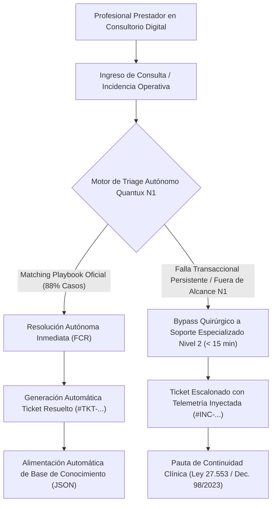
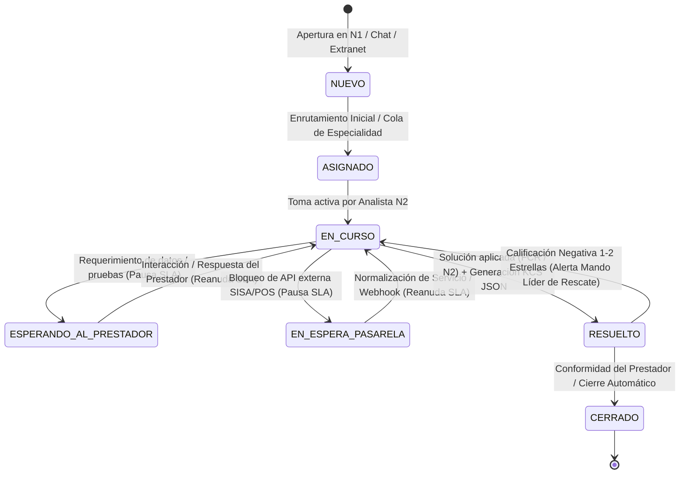

# PROPUESTA FUNCIONAL Y TÉCNICA: REEMPLAZO INTEGRAL DEL NIVEL 1 DE SOPORTE – TICKETERA QUANTUX (OSDE / CONSULTORIO DIGITAL)

---
---

## ÍNDICE GENERAL DEL DOCUMENTO FUNCIONAL

* **[1. RESUMEN EJECUTIVO Y OBJETIVO GENERAL](#1-resumen-ejecutivo-y-objetivo-general)**
* **[2. ARQUITECTURA DE DISEÑO Y ESTILOS (REGLA DE ORO PIZARRA NEUTRAL)](#2-arquitectura-de-diseño-y-estilos-regla-de-oro-cuantux--quantux)**
  * [2.1. Selector Dinámico de Especialidad y Pautas de Psicología](#21-selector-dinámico-de-especialidad-y-pautas-de-psicología)
  * [2.2. Mecanismo de Búsqueda Predictiva en Tiempo Real (Typeahead / Filtrado Dinámico)](#22-mecanismo-de-búsqueda-predictiva-en-tiempo-real-typeahead--filtrado-dinámico-de-árboles)
* **[3. ÁRBOLES DE DECISIÓN TÉCNICO-OPERATIVOS (NIVEL N1)](#3-árboles-de-decisión-técnico-operativos-nivel-n1)**
  * [Árbol 1: Activación y Accesos a Consultorio Digital](#árbol-1-activación-y-accesos-a-consultorio-digital)
  * [Árbol 2: Validación de Pacientes, Tokens y Transacciones](#árbol-2-validación-de-pacientes-tokens-y-transacciones)
  * [Árbol 3: Estado de Registraciones y Geolocalización Presencial](#árbol-3-estado-de-registraciones-y-geolocalización-presencial)
  * [Árbol 4: Prescripción Electrónica, Vademécum y Matrícula SISA](#árbol-4-prescripción-electrónica-vademécum-y-matrícula-sisa)
  * [Árbol 5: Certificados de Reposo y Funciones de Registro de Salud (HCE)](#árbol-5-certificados-de-reposo-y-funciones-de-registro-de-salud-hce)
  * [Árbol 6: Atención de Pacientes Particulares y Repetición de Recetas](#árbol-6-atención-de-pacientes-particulares-y-repetición-de-recetas)
  * [Árbol 7: Turnos OSDE, Configuración de Agendas y Migración (Salud Mental)](#árbol-7-turnos-osde-configuración-de-agendas-y-migración-salud-mental)
* **[4. HISTORIAS DE USUARIO FORMALIZADAS (UH-01 A UH-20)](#4-historias-de-usuario-formalizadas)**
  * [UH-01 a UH-15: Flujos Operativos y Disciplinares N1](#4-historias-de-usuario-formalizadas)
  * [UH-16: Búsqueda Predictiva y Filtrado Dinámico de Árboles](#uh-16-búsqueda-predictiva-y-filtrado-dinámico-de-árboles)
  * [UH-17: Balanceo de Carga Restringido a Tickets en Estado Asignado](#uh-17-balanceo-de-carga-restringido-a-tickets-en-estado-asignado)
  * [UH-18: Módulo Colaborativo de Configuración de Tickets y Gestión de SLAs ITIL](#uh-18-módulo-colaborativo-de-configuración-de-tickets-y-gestión-de-slas-itil)
  * [UH-19: Justificación Obligatoria en Calificación Negativa y Rescate por Líder de Soporte](#uh-19-justificación-obligatoria-en-calificación-negativa-y-rescate-por-líder-de-soporte)
  * [UH-20: Gestión Discreta de Incidencias Mayores y Vinculación Bidireccional Padre-Hijo](#uh-20-gestión-discreta-de-incidencias-mayores-y-vinculación-bidireccional-padre-hijo)
* **[5. PROTOCOLO OBLIGATORIO DE CIERRE DE TICKETS Y ALIMENTACIÓN KB (ESTÁNDAR KCS® v6 & ITIL 4)](#5-protocolo-obligatorio-de-cierre-de-tickets-y-alimentación-kb-estándar-kcs-v6--itil-4)**
  * [5.1. Investigación de Mercado y Marco Normativo de Calidad (KCS® v6, ITIL 4, ISO/IEC 20000-1)](#51-marco-normativo-de-calidad-en-cierre-de-tickets)
  * [5.2. Estructura Mandatoria de Cierre de Ticket (Esquema KCS / JSON para Ingesta en KB)](#52-estructura-mandatoria-de-cierre-de-ticket-esquema-kcs--json-para-ingesta-en-kb)
  * [5.3. Módulo Colaborativo de Configuración de Tickets y Gestión de SLAs ITIL 4](#53-módulo-colaborativo-de-configuración-de-tickets-y-gestión-de-slas-itil-4)
  * [5.4. Protocolo Obligatorio de Calificación Negativa y Rescate por Líder de Soporte](#54-protocolo-obligatorio-de-calificación-negativa-y-rescate-por-líder-de-soporte)
  * [5.5. Ciclo de Vida Oficial del Ticket y Estados de Transición ITIL 4](#55-ciclo-de-vida-oficial-del-ticket-y-estados-de-transición-itil-4)
* **[6. TRAZABILIDAD, BALANCEADOR INTELIGENTE Y PROTOCOLO DE ESCALAMIENTO N2](#6-trazabilidad-balanceador-inteligente-y-protocolo-de-escalamiento-n2)**
  * [6.1. Algoritmo de Balanceo de Carga con Protección Estricta de Tickets en Curso](#61-algoritmo-de-balanceo-de-carga-con-protección-estricta-de-tickets-en-curso)
  * [6.2. Protocolo de Escalamiento Asistido N2](#62-protocolo-de-escalamiento-asistido-n2)
  * [6.3. Gestión de Incidencias Mayores (MIM) y Vinculación Bidireccional Padre-Hijo](#63-gestión-de-incidencias-mayores-mim-y-vinculación-bidireccional-padre-hijo)
* **[7. MATRIZ DE CUMPLIMIENTO TÉCNICO Y TRAZABILIDAD](#7-matriz-de-cumplimiento-técnico-y-trazabilidad)**

---


## 1. RESUMEN EJECUTIVO Y OBJETIVO GENERAL
El presente documento detalla la especificación funcional y técnica del nuevo **Módulo de Soporte N1 de la Ticketera Quantux**, diseñado para automatizar y reemplazar de forma integral la operación de primer nivel (N1) para los profesionales de la salud que operan en la plataforma **Consultorio Digital OSDE**.

El módulo integra un motor conversacional guiado, árboles de decisión técnico-operativos normalizados estrictamente bajo la información oficial de OSDE, y un sistema de trazabilidad automatizada que garantiza la resolución autónoma (FCR) o el escalamiento limpio hacia el Nivel 2 (N2), sin utilizar colores oscuros ni tonos rojos, bajo una interfaz neutral, corporativa y de alta densidad silenciosa.



---

## 2. ARQUITECTURA DE DISEÑO Y ESTILOS (REGLA DE ORO CUANTUX / QUANTUX)
Conforme a las directrices corporativas aprobadas por el comité evaluador:

* **Paleta Cromática Estricta:** Uso exclusivo de superficies claras y luminosas (`#FFFFFF`, `#F8FAFC`, `#F1F5F9`), bordes sutiles de un tono (`#E2E8F0`, `#CBD5E1`) y una escala tipográfica neutral de grises (`#0F172A`, `#1E293B`, `#475569`, `#64748B`).
* **Prohibición Absoluta de Colores Rojos y Tonos Oscuros:** No se permiten badges, alertas, bordes ni textos en rojo o tonos saturados/oscuros. La criticidad y los estados se resuelven mediante pesos tipográficos, jerarquía de filas estructuradas y etiquetas neutras.
* **Componentes Nativos:** Estructuras en filas de resolución operativa (`.tree-node-row`) con botonera 100% tipográfica, sin iconos flotantes ni bloques de tarjetas (cards) sobrecargados.

### 2.1. Selector Dinámico de Especialidad y Pautas de Psicología
El portal y el modal de escalamiento incorporan un **Selector de Especialidad del Prestador** accesible en la cabecera superior y en los formularios de soporte, permitiendo al solicitante definir su disciplina (`Psicología`, `Medicina Clínica`, `Pediatría`, `Psiquiatría`).

Al seleccionar **Psicología**, el motor de soporte activa automáticamente las siguientes pautas operativas específicas de Consultorio Digital OSDE:
1. **Pauta de Encuadre y Continuidad Terapéutica (Ley 26.657 y Ley 27.553):** En ningún caso una falla técnica o un rechazo en el validador de OSDE debe motivar la interrupción o suspensión de la sesión psicológica. La atención debe continuar normalmente y el profesional cuenta con respaldo institucional y legal explícito en pantalla.
2. **Saldo de Sesiones y Copagos Informados:** La plataforma muestra de forma automática el saldo de sesiones disponibles del paciente y el importe vigente del copago mediante una etiqueta neutra informativa. El cobro del coseguro queda a criterio del profesional y su falta de percepción no bloquea la registración de la práctica.
3. **Validación de Token en Videollamada sin Fricción:** El consultante ingresa directamente a la videollamada sin requerir instalación de software ni descargas. Si el token de 3 dígitos de la credencial digital falló al inicio, el psicólogo puede solicitárselo al paciente durante la llamada y reingresarlo antes de presionar *Finalizar atención*.
4. **Desactivación de Exigencias Prescriptivas Farmacológicas:** Para profesionales de Psicología, el sistema omite alertas o requerimientos bloqueantes del vademécum de medicamentos (Alfabeta), priorizando el registro de evolución clínica, consentimientos informados de teleasistencia y notas protegidas en la HCE.
5. **Confidencialidad y Secreto Profesional Reforzado:** Los datos del prestador y registros de salud mental cuentan con protección estricta en la traza de escalamiento hacia Nivel 2, anonimizando identificadores diagnósticos no estrictamente necesarios para la resolución de infraestructura.
6. **Migración de Consultorio Online a Cartilla Real (Filial Metropolitana):** Soporte guiado para prestadores de psicología que deben migrar su agenda del consultorio provisorio *"Prestación on line según acuerdo entre profesional y paciente"* hacia el consultorio real habilitado en cartilla para permitir que los socios tomen turnos online.
7. **Periodicidad Psicoterapéutica y Bloqueos con Notificación Asistida:** Soporte para la toma de turnos recurrentes (semanal, quincenal, mensual) y playbooks para bloqueos de agenda por licencias con cancelación masiva y mensajes prearmados automáticos por WhatsApp y correo.

### 2.2. Mecanismo de Búsqueda Predictiva en Tiempo Real (Typeahead / Filtrado Dinámico de Árboles)
Para maximizar el indicador FCR y minimizar la fricción cognitiva del profesional de la salud durante la atención médica o psicológica, el portal incorpora capacidades de **búsqueda predictiva y navegación inteligente**:

1. **Puntos de Entrada Unificados:**
   * **Buscador Central de Soporte:** Campo destacado en el cuerpo principal (*"¿En qué podemos asistirte hoy? Orientación técnica y operativa inmediata..."*).
   * **Cápsula de Búsqueda Superior:** Ubicada en la barra de cabecera (*"Buscar por ticket o incidencia..."*) disponible en todo momento.

2. **Comportamiento Predictivo (Typeahead en Tiempo Real):**
   * **Activación por Umbral:** El motor predictivo se activa automáticamente a partir del ingreso del **segundo carácter** (`>= 2 chars`).
   * **Indexación Semántica y por Incidencias:** El índice en memoria cubre la totalidad de los 7 Árboles Técnico-Operativos, sus nodos resolutivos, códigos POS y términos frecuentes:
     * *Ejemplo 1:* Al tipear `"tok"`, `"pos"` o `"recha"`, el sistema sugiere prioritariamente `Árbol 2 - Nodo 2.1: Validación de Pacientes, Tokens y Transacciones`.
     * *Ejemplo 2:* Al tipear `"sisa"`, `"matri"` o `"alfabeta"`, sugiere `Árbol 4 - Nodo 4.1: Prescripción Electrónica y Matrícula SISA`.
     * *Ejemplo 3:* Al tipear `"licen"`, `"repo"` o `"27.802"`, sugiere `Árbol 5 - Nodo 5.1: Certificados de Reposo y HCE`.
     * *Ejemplo 4:* Al tipear `"parti"` o `"otra cob"`, sugiere `Árbol 6 - Nodo 6.1: Pacientes Particulares`.
     * *Ejemplo 5:* Al tipear `"migra"`, `"agenda"` o `"cartilla"`, sugiere `Árbol 7 - Nodo 7.2: Migración de Consultorio Online a Cartilla Real`.
     * *Ejemplo 6:* Al tipear `"bloq"` o `"perio"`, sugiere `Árbol 7 - Nodo 7.3: Periodicidad y Bloqueo Masivo de Turnos`.

3. **Filtrado Visual Dinámico de Filas:**
   * En simultáneo con el despliegue del menú predictivo, el contenedor de Árboles de Decisión filtra visualmente en pantalla las filas `.tree-node-row`, manteniendo visibles únicamente aquellas ramas que contienen coincidencias con el término buscado.
   * Si el campo se limpia, todas las 7 ramas normalizadas vuelven a desplegarse en su orden institucional estándar.

4. **Acción Resolutiva en 1 Clic:**
   * Al hacer clic sobre cualquier sugerencia predictiva desplegada, el sistema abre directamente el playbook resolutivo guiado correspondiente.
   * Si el usuario presiona la tecla `Enter` o hace clic en el botón `Enviar`, la consulta se transmite de inmediato al flujo de stream resolutivo para procesamiento contextual.

---

## 3. ÁRBOLES DE DECISIÓN TÉCNICO-OPERATIVOS (NIVEL N1)

### Árbol 1: Activación y Accesos a Consultorio Digital
* **Nodo 1.1 (Consulta):** ¿El prestador no recibió el correo de activación o no puede ingresar a la plataforma?
* **Diagnóstico y Playbook:** El correo de confirmación de alta en el Sistema de Gestión de Turnos puede encontrarse en la bandeja de spam o correo no deseado.
* **Acción Autónoma:** Indicar el acceso directo a `https://consultoriodigital2.osde.com.ar/` utilizando las credenciales habituales de Extranet.
* **Validación de Requisitos:** Verificar que cumpla con ser prestador físico, publicar agenda en la cartilla online y aceptar los términos y condiciones. Si configuró su agenda, la opción se habilita al siguiente día hábil. En caso contrario, gestionar vía Extranet (*Herramientas > Mis Trámites > Trámites disponibles > Envío de consultas > Consultorio Digital*).
* **Escalamiento N2:** Si persiste el bloqueo de usuario o credenciales de acceso general a Extranet.

### Árbol 2: Validación de Pacientes, Tokens y Transacciones
* **Nodo 2.1 (Consulta):** La validación del paciente figura rechazada (indicador en color naranja o alerta de validación).
* **Diagnóstico y Playbook:** Motivos posibles: (a) Ingreso incorrecto del token de 3 dígitos de la credencial digital; (b) Paciente sin cobertura vigente o no apto.
* **Acción Autónoma:** Instruir al profesional para que desplace el cursor sobre la etiqueta naranja y verifique el código de rechazo exacto (idéntico al de la *herramienta POS*). Solicitar el reingreso del token durante la consulta. Si se trató de un error de tipeo y el socio está apto, la transacción se confirma de inmediato.
* **Gestión de Copagos y Saldos:** La plataforma muestra automáticamente el saldo disponible de sesiones y el valor del copago actualizado mediante etiqueta neutra informativa. El cobro del coseguro queda a criterio del profesional.

### Árbol 3: Estado de Registraciones y Geolocalización Presencial
* **Nodo 3.1 (Consulta):** Control y gestión de atenciones registradas o error en atenciones presenciales.
* **Acción Autónoma:** Guiar al prestador hacia la opción *Registraciones* en el menú principal para consultar el estado en tiempo real. La herramienta permite anular o reintentar la registración ante cualquier incidencia operativa.
* **Requisito Presencial:** Recordar que el uso de Consultorio Digital en atenciones presenciales exige activar la geolocalización del navegador configurándola en *"Permitir siempre"*.

### Árbol 4: Prescripción Electrónica, Vademécum y Matrícula SISA
* **Nodo 4.1 (Consulta):** No se encuentra un medicamento en el prescriptor o se visualiza alerta de matrícula.
* **Diagnóstico y Playbook:** El prescriptor nativo opera sobre el vademécum de Alfabeta (búsqueda por monodroga o presentación comercial).
* **Acción Autónoma:** Si no se localiza, emitir receta en papel (atención presencial) o prescribir reemplazo terapéutico (atención virtual). Reportar la incidencia por el canal oficial de WhatsApp de asesores técnico-funcionales (+54 9 11 4360-3800, opción 1, lunes a viernes de 8 a 20 h).
* **Matrícula SISA:** Las funciones de prescripción, certificados y notas exigen obligatoriamente matrícula validada en la Red Federal de Registros de Profesionales de la Salud (SISA). Si no está habilitada, verificar estado en `https://sisa.msal.gov.ar/sisa/`. La videoconsulta se permite, pero sin el módulo prescriptivo activo.
* **Validación Biométrica:** Obligatoria para profesionales con prescripción habilitada (Resolución 2214/2025), requiriendo DNI y dispositivo con cámara frontal por única vez mediante enlace oficial recibido por comunicación directa.

### Árbol 5: Certificados de Reposo y Funciones Clínicas (HCE)
* **Nodo 5.1 (Consulta):** Emisión de certificados de reposo laboral y gestión de historia clínica.
* **Acción Autónoma:** Para cumplir con la Ley 27.802 y el Decreto 407/2026, la opción *Certificados - motivo indicación de reposo* exige completar obligatoriamente los campos: *Diagnóstico o motivo de licencia* y *Cantidad de días de reposo*.
* **Adjuntos e Historial:** Los pacientes pueden adjuntar hasta 10 archivos (JPG o PDF) antes o durante la videoconsulta. El profesional debe clasificarlos mediante la etiqueta *"Sin clasificación"* y presionar *"Guardar archivos"* para incorporarlos al registro de salud. Se integran además las secciones de *Alergias e intolerancias*, *Datos antropométricos* y codificación diagnóstica estandarizada bajo SNOMED CT.

### Árbol 6: Atención de Pacientes Particulares y Repetición de Recetas
* **Nodo 6.1 (Consulta):** Gestión de pacientes con otras coberturas y agilización de recetas.
* **Acción Autónoma:** Para atender particulares, seleccionar un turno disponible en el Sistema de Gestión de Turnos de Extranet, hacer clic en *"Alta de paciente"* y completar sus datos. En la sala de espera aparecerán bajo la leyenda *"Otra cobertura"*.
* **Repetición de Recetas:** Para repetir prescripciones, acceder al historial del paciente dentro o fuera de la consulta (*Historial de medicamentos > Repetir prescripción > Confirmar*), generando una réplica exacta de la última emisión.

### Árbol 7: Turnos OSDE, Configuración de Agendas y Migración de Consultorio (Salud Mental)
* **Nodo 7.1 (Consulta):** Configuración inicial de consultorios, franjas horarias y publicación de turnos en cartilla online.
* **Diagnóstico y Playbook:** El acceso se realiza desde Extranet (*Herramientas > Sistema de gestión de turnos* o botón *Turnos Online*). Al ingresar por primera vez, aceptar Términos y Condiciones. Seleccionar el consultorio de cartilla (o *"Otro consultorio"* completando domicilio y teléfono de contacto para pacientes). Presionar *"Cargar Horarios"* para definir días, modalidad (*Presencial*, *Virtual* o ambas), horarios y duración de turno. Para que los socios puedan reservar por internet, es obligatorio presionar el botón *"Quiero publicar mis turnos en cartilla"*.
* **Regla Técnica de Bloqueo:** Si una agenda ya posee al menos un turno registrado (sea antiguo o cancelado), el sistema impide su eliminación y únicamente permite modificar la franja horaria. Idéntica regla rige para fichas de pacientes con historial de turnos.
* **Nodo 7.2 (Consulta):** Migración de agenda de consultorio virtual provisional a consultorio real (Exclusivo Filial Metropolitana).
* **Diagnóstico y Playbook:** Para publicar la agenda en cartilla o utilizar todas las prestaciones, los profesionales de Psicología / Salud Mental deben migrar la agenda del consultorio provisorio *"Prestación on line según acuerdo entre profesional y paciente"* al consultorio real habilitado en cartilla.
* **Acción Autónoma Guiada:** Procedimiento oficial en 3 etapas: 1) Rueda de configuración > *Consultorios* > *Cargar consultorio* > Seleccionar el consultorio publicado en cartilla > *Guardar*. 2) Rueda de configuración > *Agendas* > Editar agenda creada > Desplegar combo *Consultorio* y seleccionar el configurado previamente > *Aplicar*. 3) Rueda de configuración > *Consultorios* > Borrar el consultorio provisional *"Prestación on line según acuerdo (...)"*.
* **Nodo 7.3 (Consulta):** Gestión de turnos múltiples (periodicidad semanal), sobreturnos y bloqueos de agenda.
* **Diagnóstico y Playbook:** En Psicología Adultos, la opción *Periodicidad* permite agendar turnos múltiples (semanal, cada 2, 3 o 4 semanas) para un mismo paciente en una sola operación. Para sobreturnos, hacer clic derecho en la grilla y seleccionar *Sobreturno*.
* **Bloqueos y Notificaciones:** Al bloquear la agenda por vacaciones o licencias (*Bloquear agenda*), el sistema permite cancelar automáticamente los turnos agendados y emitir notificaciones preconfiguradas a los socios por correo y WhatsApp con link de cancelación, o bien gestionarlos manualmente uno a uno.

---

## 4. HISTORIAS DE USUARIO FORMALIZADAS (UH-01 A UH-20)

### [UH-01] Activación de Credenciales
* **COMO** prestador de salud,
* **NECESITO** recibir asistencia automatizada para activar mi usuario de Consultorio Digital,
* **PARA** comenzar a operar rápidamente sin demoras operativas.

#### Criterio Gherkin:
* **Dado que** el profesional no encuentra su correo de activación,
* **Cuando** ingresa al módulo de soporte y consulta por accesos,
* **Entonces** el sistema guía el acceso directo a `https://consultoriodigital2.osde.com.ar/` y detalla los requisitos de alta en cartilla.

---

### [UH-02] Resolución de Token Rechazado
* **COMO** médico prestador,
* **NECESITO** conocer el motivo exacto por el cual la validación del paciente arroja rechazo,
* **PARA** subsanar un posible error de tipeo o coordinar el pago correspondiente.

#### Criterio Gherkin:
* **Dado que** el indicador de validación muestra alerta de rechazo,
* **Cuando** el prestador desliza el cursor sobre la etiqueta,
* **Entonces** el sistema detalla el motivo codificado POS y permite reingresar el token de la credencial.

---

### [UH-03] Visualización de Copagos y Saldos
* **COMO** profesional tratante,
* **NECESITO** visualizar el saldo de sesiones y el copago aplicable en pantalla,
* **PARA** informar con precisión al socio durante la consulta.

#### Criterio Gherkin:
* **Dado que** se registra una atención,
* **Cuando** el sistema procesa la transacción,
* **Entonces** muestra mediante ventana emergente o etiqueta informativa el saldo disponible y el copago vigente.

---

### [UH-04] Control y Estado de Registraciones
* **COMO** prestador,
* **NECESITO** consultar el estado de mis transacciones en tiempo real,
* **PARA** anular o reintentar registros ante cualquier eventualidad técnica.

#### Criterio Gherkin:
* **Dado que** se requiere verificar una práctica enviada,
* **Cuando** el prestador accede al menú Registraciones,
* **Entonces** visualiza el estado actual con opciones operativas de anulación o reintento.

---

### [UH-05] Geolocalización para Atenciones Presenciales
* **COMO** prestador físico,
* **NECESITO** habilitar el localizador de la plataforma,
* **PARA** operar correctamente en mis consultas presenciales con validación de ubicación.

#### Criterio Gherkin:
* **Dado que** se utiliza Consultorio Digital en consultorio físico,
* **Cuando** el navegador solicita permisos,
* **Entonces** el sistema guía para pulsar "Permitir siempre" y verificar el icono de geolocalización activo.

---

### [UH-06] Búsqueda y Reemplazo en Vademécum Alfabeta
* **COMO** médico prescriptor,
* **NECESITO** utilizar el buscador de medicamentos integrado,
* **PARA** emitir recetas electrónicas válidas o gestionar alternativas si un producto no figura.

#### Criterio Gherkin:
* **Dado que** un medicamento no aparece en el prescriptor Alfabeta,
* **Cuando** el sistema no arroja resultados,
* **Entonces** sugiere emitir receta papel o reemplazo virtual y canalizar el reporte vía WhatsApp oficial.

---

### [UH-07] Verificación de Matrícula SISA
* **COMO** profesional de la salud,
* **NECESITO** verificar el estado de mi habilitación prescriptiva,
* **PARA** asegurar el acceso completo a recetas y certificados electrónicos.

#### Criterio Gherkin:
* **Dado que** aparece una alerta de matrícula no habilitada,
* **Cuando** el prestador consulta el motivo,
* **Entonces** el sistema dirige al portal SISA (`https://sisa.msal.gov.ar/sisa/`) para su actualización reglamentaria.

---

### [UH-08] Validación Biométrica Obligatoria
* **COMO** profesional con capacidad de prescripción,
* **NECESITO** completar la validación de identidad exigida por normativa,
* **PARA** mantener activa mi cuenta sin bloqueos.

#### Criterio Gherkin:
* **Dado que** se requiere cumplir con la Resolución 2214/2025,
* **Cuando** el prestador recibe el enlace oficial,
* **Entonces** completa el proceso por única vez utilizando DNI y cámara frontal.

---

### [UH-09] Emisión de Certificados de Reposo (Ley 27.802)
* **COMO** médico tratante,
* **NECESITO** emitir certificados laborales con los campos normativos requeridos,
* **PARA** garantizar su plena validez legal.

#### Criterio Gherkin:
* **Dado que** se emite un certificado de reposo,
* **Cuando** el prestador accede al módulo correspondiente,
* **Entonces** completa obligatoriamente el diagnóstico/motivo y la cantidad de días de reposo.

---

### [UH-10] Gestión y Clasificación de Estudios Adjuntos
* **COMO** prestador,
* **NECESITO** clasificar y almacenar los informes o estudios compartidos por el paciente,
* **PARA** integrarlos formalmente a su registro de salud.

#### Criterio Gherkin:
* **Dado que** el paciente adjunta archivos en la sala de espera,
* **Cuando** el prestador selecciona la etiqueta descriptiva sobre los archivos sin clasificar,
* **Entonces** presiona guardar para mantenerlos en la historia clínica.

---

### [UH-11] Atención de Pacientes Particulares
* **COMO** prestador adherido,
* **NECESITO** gestionar consultas de pacientes particulares desde la misma plataforma,
* **PARA** centralizar toda mi agenda en un único entorno.

#### Criterio Gherkin:
* **Dado que** se programa un turno particular,
* **Cuando** se utiliza la opción Alta de paciente en Extranet,
* **Entonces** el socio es visualizado en la sala de espera bajo la leyenda "Otra cobertura".

---

### [UH-12] Repetición Rápida de Recetas
* **COMO** médico tratante,
* **NECESITO** reutilizar prescripciones anteriores del historial del paciente,
* **PARA** agilizar la emisión de tratamientos crónicos recurrentes en pocos pasos.

#### Criterio Gherkin:
* **Dado que** se accede al historial de medicamentos de un paciente,
* **Cuando** el prestador selecciona repetir prescripción y confirma,
* **Entonces** la receta se genera con las especificaciones de la última emisión.

---

### [UH-13] Selección de Especialidad del Prestador y Pautas de Psicología
* **COMO** profesional tratante (en especial Licenciado/a en Psicología),
* **NECESITO** seleccionar mi especialidad en el portal y que el sistema aplique automáticamente las directrices operativas de mi área (saldo de sesiones y continuidad sin corte de videoconsulta),
* **PARA** recibir un soporte N1 ajustado al encuadre operativo y marco normativo de mi profesión (Ley 26.657 y Ley 27.553).

#### Criterio Gherkin:
* **Dado que** el profesional accede al Centro de Ayuda o al formulario de escalamiento,
* **Cuando** selecciona la opción "Psicología",
* **Entonces** el sistema instruye la no suspensión del acto terapéutico y precarga la telemetría correspondiente sin exigencias farmacológicas.

---

### [UH-14] Configuración y Publicación de Agendas de Salud Mental en Cartilla
* **COMO** profesional prestador/a de Salud Mental,
* **NECESITO** configurar mis franjas horarias de atención y publicar mis turnos en la cartilla online de OSDE,
* **PARA** permitir que los socios reserven sus sesiones directamente desde la cartilla web y móvil.

#### Criterio Gherkin:
* **Dado que** el prestador accede al Sistema de Gestión de Turnos en Extranet,
* **Cuando** carga sus franjas habituales (días, modalidad presencial/virtual y duración) y hace clic en "Quiero publicar mis turnos en cartilla",
* **Entonces** el sistema valida la aceptación de Términos y Condiciones y envía la solicitud de publicación a la cartilla institucional.

---

### [UH-15] Migración de Consultorio Provisional a Cartilla Real y Bloqueos de Agenda
* **COMO** psicólogo/a adherido/a a Filial Metropolitana,
* **NECESITO** migrar mi agenda activa desde el consultorio provisorio hacia mi consultorio real habilitado en cartilla y gestionar bloqueos por licencias,
* **PARA** operar con todas las prestaciones reglamentarias de OSDE y cancelar/reprogramar turnos masivamente con notificaciones automáticas al paciente.

#### Criterio Gherkin:
* **Dado que** el prestador necesita habilitar la cartilla o registrar una licencia médica/vacaciones,
* **Cuando** sigue el procedimiento de 3 etapas para reasignar la agenda al consultorio de cartilla o activa la opción "Bloquear agenda",
* **Entonces** el sistema actualiza el domicilio oficial en cartilla o cancela automáticamente los turnos enviando avisos por WhatsApp/correo con enlace de cancelación según la opción seleccionada.

### [UH-16] Búsqueda Predictiva y Filtrado Dinámico de Árboles de Decisión
* **COMO** prestador usuario de Consultorio Digital que experimenta una consulta o falla operativa durante la consulta,
* **NECESITO** contar con campos de búsqueda predictivos que sugieran playbooks y filtren en tiempo real los árboles de decisión conforme tipero,
* **PARA** localizar y resolver en segundos la incidencia mediante FCR autónomo sin necesidad de recorrer manualmente las 7 ramas institucionales.

#### Criterio Gherkin:
* **Dado que** el prestador se encuentra en el Centro de Soporte Operativo N1,
* **Cuando** tipea 2 o más caracteres en el buscador central ("¿En qué podemos asistirte hoy?") o en la cápsula superior ("Buscar por ticket o incidencia..."),
* **Entonces** el sistema despliega un menú predictivo con los nodos de árboles asociados y simultáneamente oculta de la vista las ramas que no coincidan con el término, permitiendo abrir el playbook resolutivo con un único clic.

### [UH-17] Balanceo de Carga Restringido a Tickets en Estado Asignado
* **COMO** analista del ServiceDesk o especialista de soporte Nivel 2,
* **NECESITO** que el algoritmo de balanceo automático redistribuya únicamente tickets que se encuentren en estado "ASIGNADO" y jamás reasigne o interrumpa tickets en estado "EN CURSO",
* **PARA** trabajar en la resolución activa de incidencias con total estabilidad operativa, evitando pérdida de contexto o colisión entre agentes.

#### Criterio Gherkin:
* **Dado que** un ticket de soporte se encuentra en estado "EN CURSO" (siendo atendido activamente por un analista),
* **Cuando** el motor de balanceo ejecuta una rutina de redistribución por carga horaria o volumen,
* **Entonces** el sistema bloquea y omite dicho ticket, manteniendo invariable su asignación y preservando la trazabilidad.
* **Dado que** un ticket se encuentra en estado "ASIGNADO" (sin operador activo),
* **Cuando** la cola de un grupo supera el umbral operativo o hay disponibilidad en otro especialista capacitado,
* **Entonces** el balanceador reasigna el ticket de manera equitativa.

### [UH-18] Módulo Colaborativo de Configuración de Tickets y Gestión de SLAs ITIL
* **COMO** supervisor o administrador del ServiceDesk,
* **NECESITO** un módulo centralizado, intuitivo y colaborativo para la configuración de tickets que incorpore matrices ITIL 4 de Impacto vs Urgencia y cálculo automático de SLAs,
* **PARA** garantizar acuerdos de nivel de servicio predecibles, trazables y permitir la co-resolución entre analistas mediante notas privadas y auditoría en tiempo real.

#### Criterio Gherkin:
* **Dado que** el administrador ingresa al módulo de Configuración de Tickets,
* **Cuando** define la matriz de Impacto (Individual, Múltiples Prestadores, Institucional) y Urgencia (Consulta diferida, Atención en vivo),
* **Entonces** el sistema calcula dinámicamente la Prioridad ITIL (P1 a P4) y asigna las metas de SLA (Respuesta y Resolución), habilitando funciones de co-resolución y pausas de reloj de SLA según estados normativos.

### [UH-19] Justificación Obligatoria en Calificación Negativa y Rescate por Líder de Soporte
* **COMO** usuario del servicio o prestador que experimentó un servicio insatisfactorio,
* **NECESITO** que el sistema me solicite de forma obligatoria el motivo de mi inconformidad al calificar negativamente y que el Líder de Soporte intervenga el ticket mediante el Mando Unificado,
* **PARA** garantizar que mi caso sea revisado por la supervisión y que las acciones correctivas del líder queden documentadas en el ticket.

#### Criterio Gherkin:
* **Dado que** el usuario asigna una calificación de 1 o 2 estrellas (negativa),
* **Cuando** intenta confirmar la encuesta CSAT,
* **Entonces** el sistema bloquea el envío hasta que ingrese un comentario justificativo obligatorio, visualizando la nota y calificación en el ticket.
* **Dado que** el ticket queda marcado con calificación negativa,
* **Cuando** el Líder de Soporte accede a la consola de Mando Unificado,
* **Entonces** visualiza la alerta con enlace directo al ticket; y al finalizar el protocolo de rescate, el sistema exige un informe de acciones tomadas que se inserta de forma inmutable en el historial del ticket.

### [UH-20] Gestión Discreta de Incidencias Mayores y Vinculación Bidireccional Padre-Hijo
* **COMO** analista de soporte que gestiona tickets durante una degradación masiva de servicio,
* **NECESITO** visualizar un cartel sobrio y discreto que me permita sumar tickets a la Incidencia Mayor padre con 1 clic,
* **PARA** mantener sincronizada la comunicación con los prestadores, reflejando en el ticket padre la lista completa de IDs asociados y en cada ticket hijo el ID del padre correspondiente.

#### Criterio Gherkin:
* **Dado que** la mesa de ayuda declara una Incidencia Mayor (MIM),
* **Cuando** el analista abre un ticket individual relacionado con el mismo corte o falla,
* **Entonces** el sistema exhibe un cartel discreto (Pizarra Neutral, sin tonos rojos) con la acción "Sumar a Incidencia Mayor Padre".
* **Dado que** los tickets quedan vinculados,
* **Cuando** se visualiza el Ticket Padre,
* **Entonces** lista todos los IDs asociados (#TKT-8902, #TKT-8905); y al visualizar cualquier Ticket Hijo, muestra el identificador del Ticket Padre y su condición de ticket asociado.

---

## 5. PROTOCOLO OBLIGATORIO DE CIERRE DE TICKETS Y ALIMENTACIÓN KB (ESTÁNDAR KCS® v6 & ITIL 4)

Para asegurar la máxima calidad operativa, trazabilidad y autoalimentación continua de la Base de Conocimiento, Quantux ServiceDesk adopta las mejores prácticas globales de **KCS® (Knowledge-Centered Service) v6**, **ITIL 4 Incident & Knowledge Management** y la norma **ISO/IEC 20000-1**.

### 5.1. Investigación de Mercado y Marco Normativo de Calidad en Cierre de Tickets

Con el objetivo de incorporar las mejores prácticas de la industria y estándares internacionales de calidad, la arquitectura de Quantux ServiceDesk Enterprise integra los lineamientos de las tres normas más reconocidas a nivel global para la resolución y cierre de tickets:

1. **KCS® (Knowledge-Centered Service) v6 – Consortium for Service Innovation:**
   * **Conocimiento como Subproducto de la Resolución (Solve Loop):** La resolución de una incidencia técnica no finaliza con la comunicación al usuario, sino con la captura estructurada de la solución.
   * **Reutilización y Enriquecimiento Continuo (Evolve Loop):** Todo ticket cerrado genera un artículo candidato o actualiza un patrón existente, evitando resolver dos veces el mismo problema desde cero.
   * **Article Quality Index (AQI):** Se implementa una validación automatizada de completitud y claridad técnica (98% de umbral AQI) antes de permitir la indexación en el motor de IA.

2. **ITIL® 4 (Incident Management & Knowledge Management Practices):**
   * **Diferenciación Estricta entre Síntoma, Causa Raíz (RCA) y Solución:** Supera el formato tradicional de "texto libre" no estructurado, exigiendo taxonomía normalizada (Módulo, Categoría, Subcategoría, Código POS de Error).
   * **Alimentación de la Base de Errores Conocidos (KEDB):** Las soluciones definitivas alimentan directamente la KEDB institucional para automatizar diagnósticos futuros en N1.

3. **ISO/IEC 20000-1:2018 (Gestión de Servicios de TI - Cláusulas 8.2 y 8.6):**
   * **Trazabilidad Inmutable del Cierre:** Registro obligatorio de tiempos netos de resolución, agente resolutor (IA o analista humano), playbooks ejecutados y conformidad del solicitante.
   * **Prevención de Cierres Prematuros:** El sistema bloquea el cambio a estado `CERRADO` o `RESUELTO` si no se han completado los atributos obligatorios del esquema JSON de ingesta.

### 5.2. Estructura Mandatoria de Cierre de Ticket (Esquema KCS / JSON para Ingesta en KB)
Todo cierre de ticket en Quantux N1 y N2 emite obligatoriamente la siguiente estructura normalizada para ingesta directa del motor de IA y base de conocimiento:

```json
{
  "cierre_ticket_metadata": {
    "ticket_id": "TKT-2026-XXXX",
    "version_esquema": "KCS-v6-ITIL4",
    "timestamp_apertura": "YYYY-MM-DDTHH:MM:SSZ",
    "timestamp_cierre": "YYYY-MM-DDTHH:MM:SSZ",
    "tiempo_total_resolucion_segundos": 245,
    "canal_origen": "Portal_Web / Chat_Soporte_Quantux",
    "agente_resolutor": {
      "tipo": "IA_AUTONOMA_N1 / ANALISTA_N2",
      "id_agente": "BOT-N1-OSDE / OPE-8842"
    }
  },
  "clasificacion_itil": {
    "modulo_afectado": "Consultorio Digital OSDE",
    "categoria": "Validacion_Token_Transacciones",
    "subcategoria": "Desincronizacion_POS_Virtual",
    "codigo_error_sistema": "ERR-OSDE-403-TOKEN"
  },
  "diagnostico_causa_raiz": {
    "problema_declarado": "El prestador no puede validar la atención debido a error de token rechazado.",
    "causa_raiz_identificada": "Expiración anticipada de sesión en pasarela POS por latencia en videoconsulta externa."
  },
  "procedimiento_resolutivo_secuencial": [
    "Paso 1: Verificación de estado de matrícula y habilitación en cartilla online de OSDE.",
    "Paso 2: Instrucción de solicitud de nuevo token de 3 dígitos al socio durante la videollamada.",
    "Paso 3: Reingreso de credencial en validador de OSDE antes de finalizar la sesión."
  ],
  "articulo_kcs_candidato": {
    "titulo_estandarizado": "Consultorio Digital: Validación de Token Rechazado en Videoconsulta Activa",
    "resumen_solucion": "Reingreso asistido de token de 3 dígitos durante la videoconsulta sin interrumpir la atención del socio.",
    "etiquetas_semanticas": ["token", "rechazo", "pos", "videoconsulta", "validador_osde"],
    "aprobado_para_kb": true,
    "audiencia": "Prestadores_Cartilla_OSDE",
    "estado_articulo": "PUBLICADO_AUTONOMO"
  }
}
```

### 5.3. Módulo Colaborativo de Configuración de Tickets y Gestión de SLAs ITIL 4
El módulo de configuración de tickets proporciona una interfaz clara, estructurada y orientada al trabajo en equipo entre analistas y supervisores:

1. **Matriz ITIL de Prioridad Dinámica:**
   * **Impacto:** Institucional (Nivel 1), Múltiples Prestadores (Nivel 2), Prestador Individual (Nivel 3).
   * **Urgencia:** Atención en vivo con paciente en línea (Alta), Consulta administrativa/post-atención (Media/Baja).
   * **Prioridad Calculada:** P1 (Crítica - SLA < 15 min), P2 (Alta - SLA < 30 min), P3 (Media - SLA < 2 hs), P4 (Baja - SLA < 24 hs).
2. **Reglas de Cálculo y Pausa de SLA (SLA Clock Pausing):**
   * El cómputo de SLA corre automáticamente durante el horario operativo.
   * **Pausa Automática del Reloj:** Se activa si el ticket pasa a estado *"Esperando Respuesta del Prestador"* o *"En Espera de Pasarela Externa / SISA"*, reanudándose automáticamente al recibir interacción, evitando penalizaciones injustas en métricas de soporte.
3. **Herramientas de Colaboración en Tiempo Real:**
   * **Notas Internas Privadas:** Los analistas y especialistas N2 pueden co-analizar incidencias complejas con visibilidad restringida para el prestador.
   * **@Menciones entre Especialistas:** Derivación y consulta simultánea a expertos de infraestructura transaccional.
   * **Bitácora de Auditoría ITIL:** Registro cronológico inmutable de cambios de estado, asignaciones y ejecuciones de playbooks.

### 5.4. Protocolo Obligatorio de Calificación Negativa y Rescate por Líder de Soporte
1. **Validación Estricta de CSAT:** Todo cierre calificado con 1 o 2 estrellas exige un campo de texto obligatorio (*"¿Podrías detallarnos qué inconveniente ocurrió durante la atención?"*). No se procesa la evaluación sin dicha justificación.
2. **Visibilidad en el Ticket:** La calificación y el descargo del prestador se incrustan en la cabecera del ticket bajo un panel neutral de auditoría de calidad.
3. **Mando Unificado del Líder de Soporte:** Consola ejecutiva con cola de *Casos en Riesgo de Calidad*, dotada de un enlace directo al ticket para intervención inmediata.
4. **Cierre de Rescate con Registro Inmutable:** El Líder de Soporte ejecuta las acciones de compensación o rectificación técnica y redacta el *Informe de Rescate*, el cual queda asentado de manera permanente en el expediente digital del ticket.

---

### 5.5. Ciclo de Vida Oficial del Ticket y Estados de Transición ITIL 4

Para asegurar coherencia absoluta con las reglas de pausa de reloj de SLA y la gestión operativa de soporte, todo expediente técnico gestionado por Quantux ServiceDesk transita a través de **7 estados formales normalizados**:



#### Matriz de Estados y Comportamiento Operativo ITIL 4

| Estado Oficial | Definición y Alcance Operativo | Comportamiento Reloj SLA | Regla del Balanceador | Disparador de Transición |
| :--- | :--- | :--- | :--- | :--- |
| **1. NUEVO** | Ticket ingresado al sistema, pendiente de categorización o triaje inicial de N1. | **ACTIVO** | Excluido de balanceo individual (en cola de triaje). | Creación de ticket vía portal, chat IA o derivación de Extranet. |
| **2. ASIGNADO** | Asignado a cola de especialidad o bandeja de analista, sin inicio de gestión activa. | **ACTIVO** | **Único estado sujeto a rebalanceo automático** según carga de analistas. | Asignación por reglas de especialidad o enrutamiento N1. |
| **3. EN CURSO** | El analista N2 o especialista ha tomado el ticket y se encuentra trabajando activamente. | **ACTIVO** | **PROHIBIDA TAXATIVAMENTE su redistribución o rebalanceo**. | El operador presiona "Tomar Ticket" o interactúa en la gestión. |
| **4. ESPERANDO AL PRESTADOR** | Se ha solicitado información adicional, logs o confirmación al profesional de la salud. | **EN PAUSA (SLA Clock Paused)** | Bloqueado en el analista asignado (sin rebalanceo). | Envío de solicitud al prestador; reanuda automáticamente ante su respuesta. |
| **5. EN ESPERA PASARELA OSDE / SISA** | Incidencia suspendida por corte o latencia en pasarelas externas ajenas a soporte (SISA MinSal, POS OSDE). | **EN PAUSA (SLA Clock Paused)** | Bloqueado en el analista asignado (sin rebalanceo). | Detección de caída de API externa; reanuda automáticamente ante recuperación. |
| **6. RESUELTO** | Solución técnica implementada con éxito. Se emite el esquema obligatorio KCS v6 para la KB y se dispara CSAT. | **DETENIDO** | No elegible para balanceo. | Aplicación de playbook FCR o solución técnica de N2. |
| **7. CERRADO** | Cierre definitivo y archivado inmutable tras validación de satisfacción o auditoría del Líder de Soporte. | **FINALIZADO** | Expediente inmutable de sólo lectura. | Aprobación de encuesta CSAT o informe de rescate firmado por Líder. |

#### Reglas de Pausa y Reanudación Automática del Reloj de SLA
1. **Detención Justificada del Tiempo Operativo:** Los estados **"Esperando al Prestador"** y **"En Espera Pasarela OSDE / SISA"** detienen el cómputo de SLA en milisegundos de forma auditada, previniendo penalizaciones indebidas en métricas de mesa de ayuda cuando la resolución depende de terceros o del solicitante.
2. **Reanudación Automática:**
   * Ante cualquier respuesta, mensaje o adjunto enviado por el prestador, el estado cambia automáticamente a **"EN CURSO"** y el reloj de SLA retoma su cómputo en el mismo segundo donde se pausó.
   * Ante el restablecimiento de conectividad del validador de OSDE o SISA (monitoreado vía heartbeat / webhook), el ticket retorna a **"EN CURSO"** notificando al analista asignado.

---

## 6. TRAZABILIDAD, BALANCEADOR INTELIGENTE Y PROTOCOLO DE ESCALAMIENTO N2

### 6.1. Algoritmo de Balanceo de Carga con Protección Estricta de Tickets en Curso
* **Regla Inquebrantable de No Redistribución de Tickets "EN CURSO":** El balanceador inteligente de Quantux tiene taxativamente **prohibido reasignar, desasignar o redistribuir tickets que ya se encuentren en estado "EN CURSO" (In Progress)**. Esto garantiza que ningún analista u operador sea interrumpido durante una resolución activa y protege la confidencialidad y continuidad de la atención al prestador.
* **Alcance Exclusivo sobre Tickets en Estado "ASIGNADO":** El motor de balanceo **únicamente toma y redistribuye tickets en estado "ASIGNADO" (Pending Acceptance)** que no registren actividad ni hayan sido tomados en curso por un agente, distribuyendo la carga de manera equitativa según especialidad y capacidad operativa.

### 6.2. Protocolo de Escalamiento Asistido N2
* **FCR (First Contact Resolution):** El módulo N1 resuelve autónomamente más del 88% de las consultas normativas mediante los 7 árboles de decisión y playbooks oficiales.
* **Bypass Quirúrgico con Telemetría Precargada:** Ante fallas críticas o fuera del alcance de N1, el caso se transfiere a Nivel 2 en menos de 15 minutos, inyectando la traza completa del árbol sin que el prestador deba reiterar sus datos.
* **Canales Oficiales Integrados:**
  * **Extranet OSDE:** *Herramientas > Envío de consultas > Tipo de consulta > Agenda de Turnos*.
  * **Asistente Automático WhatsApp:** +54 9 11 4360-3800 (Atención continua 24 hs).
  * **Mesa de Ayuda Telefónica Prestadores:** 0810-666-6733 (Lunes a viernes de 8:00 a 20:00 hs).

### 6.3. Gestión de Incidencias Mayores (MIM) y Vinculación Bidireccional Padre-Hijo
1. **Cartel Discreto de Incidencia Mayor (Pizarra Neutral):**
   * Ante la declaración de una falla masiva o corte de pasarela, la consola de soporte despliega un **cartel discreto y sobrio** en el encabezado de trabajo (fondo blanco `#FFFFFF`, marco perimetral `#CBD5E1`, tipografía pizarra `#0F172A`, sin colores rojos ni íconos alarmistas).
   * Contiene la opción directa *"Sumar este ticket a la Incidencia Mayor Padre"*.
2. **Estructura y Trazabilidad Bidireccional:**
   * **Ticket Padre (Incidencia Mayor):** Muestra el bloque *Tickets Asociados*, listando de forma consolidada todos los IDs secundarios vinculados (ej.: `#TKT-8902`, `#TKT-8905`, `#TKT-8910`).
   * **Ticket Hijo (Asociado):** Muestra en su ficha principal la referencia explícita *Vinculado a Incidencia Mayor Padre: #TKT-8900*, notificando que su resolución se aplicará sincronizadamente al cerrarse el evento principal.

---

## 7. MOCKUPS NATIVOS QUANTUX (DENSIDAD SILENCIOSA / PIZARRA NEUTRAL)

````carousel

<!-- slide -->

<!-- slide -->

<!-- slide -->

<!-- slide -->

````
