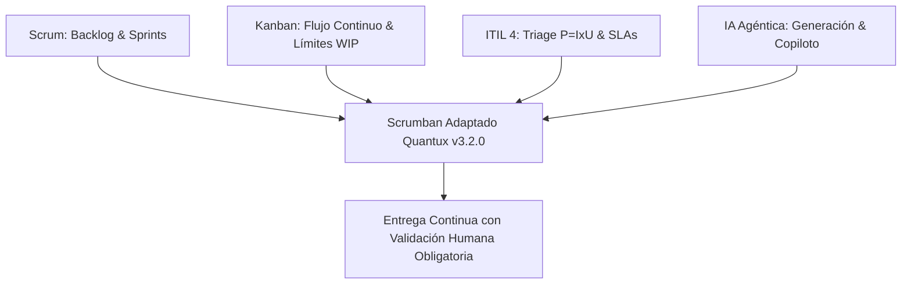
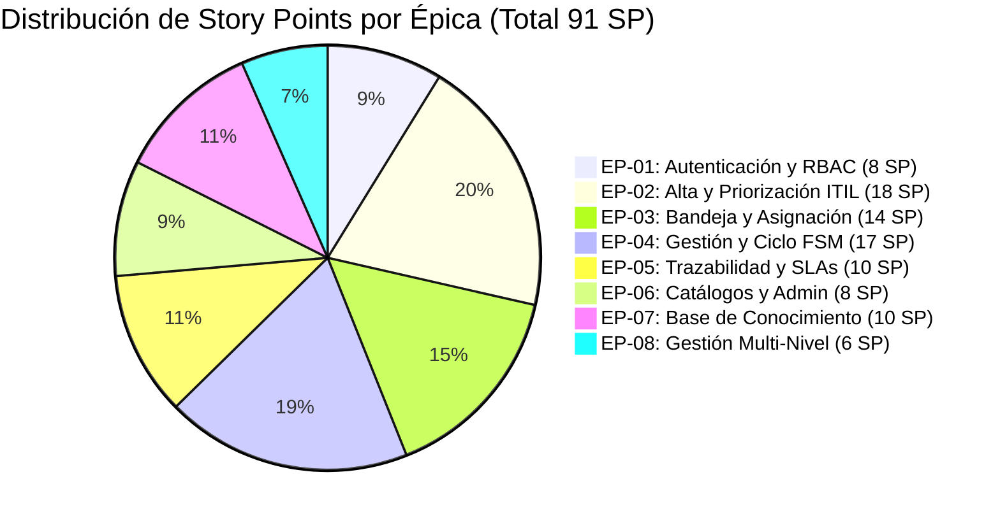

# QUANTUX SALUD • HEALTHDESK
## DOC-PM-001: PLAN DE GESTIÓN DEL PROYECTO INFORMÁTICO CON IA Y AGENTES
### GESTIÓN INTEGRAL DE INCIDENTES Y SERVICIOS PARA PLATAFORMAS HEALTHTECH

---

### METADATOS Y CONTROL DOCUMENTAL
* **Código Documental:** DOC-PM-001
* **Versión Oficial:** v3.2.0-UAT (Línea Base Extendida & Certificación TQM)
* **Fecha de Emisión:** Septiembre 2026
* **Propietario / Solution Owner:** Freddy Cortés (Analista Funcional & Product Owner)
* **Facilitador Técnico / Arquitecto:** Diego Martínez
* **Comité Evaluador & Stakeholders:** Paula Sbarbati, Diego Martínez, Carolina Brizuela, Nicolás Sánchez
* **Estado:** HOMOLOGADO & APROBADO (Certificación TQM Cero Defectos)
* **Documentos Relacionados:** DOC-FS-002 (Especificación), DOC-AR-003 (Arquitectura), DOC-QA-004 (Calidad), DOC-UM-005 (Manual Operativo), DOC-TR-006 (Matriz Trazabilidad).

---

## 1. DEFINICIÓN DEL PROYECTO Y CONTEXTO ESTRATÉGICO

### 1.1. Problema u Oportunidad de Origen
Quantux opera un ecosistema heterogéneo de **9 plataformas clínicas asistenciales** (Portal del Paciente, Historia Clínica Electrónica HCE, Telemedicina WebRTC, Receta Digital PKCS#7, Módulo de Turnos, Facturación Sanitaria, Triage de Guardia, Laboratorio/LIS e Integración RNDS) desplegadas en más de **14 sanatorios y financiadores de salud** de alta complejidad (OSDE, Swiss Medical, Galeno, Hospital Italiano, Sanatorio Mater Dei, etc.).

Con anterioridad al proyecto, la atención técnica sufría de:
1. **Dispersión y Silos Operativos:** Gestión fragmentada por WhatsApp, correos no trazables y llamadas telefónicas directas a desarrolladores.
2. **Ausencia de Triage Sanitario Objetivo:** Falta de cálculo uniforme de prioridad $P = I \times U$ (Impacto $\times$ Urgencia), lo que provocaba que fallas asistenciales críticas (ej: bloqueo en emisión de recetas en quirófano o guardia) compitieran con consultas de baja prioridad.
3. **Pérdida de Evidencia y Trazabilidad:** Inexistencia de registros de auditoría inmutables para peritajes médico-legales y SLA contractuales.
4. **Fuga de Conocimiento Técnico:** Las soluciones complejas implementadas por desarrolladores senior (N3) no se documentaban, provocando duplicación de esfuerzo y reincidencia de incidentes idénticos.

### 1.2. Objetivo General y Resultados Esperados
* **Objetivo:** Diseñar, implementar y certificar **Quantux HealthDesk v3.2.0-UAT**, un ServiceDesk asistencial de alta disponibilidad alineado con las mejores prácticas ITIL 4, dotado de un motor determinístico de estados finitos (FSM), una Base de Conocimiento clínico estructurada con versionado inmutable y un sistema asistido por IA para aceleración operativa y triage clínico.
* **Resultados Esperados:**
  * 100% de solicitudes centralizadas con código unívoco correlativo (`TICK-YYYYMM-XXXX`).
  * Reducción del Tiempo Medio de Resolución (MTTR) en un 45% mediante la Base de Conocimiento y asistencia de IA.
  * 0% de pérdida de auditoría sanitaria (registro inmutable de autor, timestamp y motivo).
  * Paridad operativa absoluta (100% éxito) en entornos locales y remotos (TQM Zero Defects).

### 1.3. Alcance y Fuera de Alcance
* **Dentro de Alcance (In-Scope):**
  * 8 Épicas funcionales y 38 Historias de Usuario (91 Story Points).
  * Autenticación multi-rol y RBAC (Solicitante, Soporte N1/N2/N3, Administrador).
  * Gestión integral del ciclo de vida del ticket: Registro $\rightarrow$ Asignación $\rightarrow$ Diagnóstico $\rightarrow$ Espera $\rightarrow$ Resolución (con guardrail $\ge 8$ caracteres y Workaround) $\rightarrow$ Cierre formal con conformidad.
  * Base de Conocimiento con 14 protocolos clínicos precargados, versionado (`v1.0`, `v1.1`), tags y auto-publicación desde tickets.
  * Panel de mesas de ayuda por especialidad y dotación N1/N2/N3.
  * Exportación forense y operativa en CSV con codificación UTF-8.
  * Aceleración y copiloto de documentación mediante IA generativa supervisada.
* **Fuera de Alcance (Out-of-Scope):**
  * Modificación directa de registros médicos de pacientes en bases de datos de sanatorios externos.
  * Toma de decisiones clínicas autónomas por modelos de IA sin validación facultativa.
  * Procesamiento de pagos directos o pasarelas financieras dentro del ServiceDesk.

### 1.4. Organización y Áreas Involucradas
* **Dirección Médica y Operaciones Clínicas:** Validación de procesos de guardia y telemedicina.
* **Mesa de Ayuda y Operaciones IT (N1/N2/N3):** Operadores de triage, analistas funcionales y especialistas de infraestructura.
* **Comité de Calidad y Evaluación (QA / Evaluadores):** Paula Sbarbati, Diego Martínez, Carolina Brizuela, Nicolás Sánchez.
* **Ingeniería de Software & Data / IA:** Freddy Cortés (Lead Architect & PO), Agente Antigravity (IA Pairing Assistant).

### 1.5. Usuarios y Stakeholders
| Rol | Población Objetivo | Necesidad Principal |
| :--- | :--- | :--- |
| **Solicitante Asistencial** | Médicos, enfermeros, secretarios de guardia | Carga ágil sin jerga técnica, seguimiento en tiempo real y confirmación de conformidad. |
| **Operador Soporte N1** | Mesa de primer contacto | Triage rápido, derivación estructurada, aplicación de protocolos de KB. |
| **Especialista Soporte N2** | Analistas funcionales y de plataforma | Diagnóstico de integraciones, registro de notas internas privadas, guardado de workarounds. |
| **Ingeniería Soporte N3** | Arquitectos, DBAs, DevOps | Resolución de fallas de infraestructura, remediación de base de datos y auto-publicación de protocolos. |
| **Administrador / Gerencia** | Gerentes de TI y Solution Owners | Tablero de control de dotación, cumplimiento de SLAs institucionales y auditoría forense. |

### 1.6. Restricciones, Supuestos y Dependencias
* **Restricciones:** No dependencia de servidores externos de bases de datos para el despliegue UAT (SQLite WAL concurrente de alta velocidad); latencia de API $< 15$ ms; compatibilidad total con navegadores modernos y dispositivos móviles sin frameworks pesados.
* **Supuestos:** Los usuarios solicitantes cuentan con conectividad web básica desde los sanatorios; los operadores respetan la confidencialidad médica en notas internas.
* **Dependencias:** Disponibilidad de túnel HTTPS seguro (Tunnelmole / TLS 1.3) para acceso externo de evaluadores sanitarios; librerías estándar Python 3.10+ y FastAPI.

### 1.7. Criterios Generales de Éxito
1. **Cobertura Funcional:** 100% de las 38 Historias de Usuario operativas y verificadas.
2. **Calidad TQM (Total Quality Management):** 14 ciclos consecutivos de pruebas automatizadas con 0 defectos (Zero Defects Certification).
3. **Gobernanza de IA:** Trazabilidad absoluta de cada componente generado con IA con validación humana formal.

---

## 2. ENFOQUE DE GESTIÓN Y ADAPTACIÓN METODOLÓGICA

### 2.1. Selección del Enfoque: Scrumban Híbrido ITIL 4 + IA Agéntica
Se seleccionó un enfoque **híbrido y adaptativo** que combina la estructura de cadencia y backlog de **Scrum**, la fluidez visual y limitación de trabajo en curso (WIP) de **Kanban**, y el rigor de procesos de servicio de **ITIL 4**, potenciado por la aceleración agéntica de **Inteligencia Artificial**.

### 2.2. Prácticas Adoptadas, Modificadas y Descartadas
* **Prácticas Adoptadas:**
  * *Backlog priorizado por valor asistencial* y matriz ITIL de criticidad.
  * *Tablero Kanban digital* con columnas vivas de flujo: Backlog $\rightarrow$ Análisis $\rightarrow$ Desarrollo Asistido IA $\rightarrow$ Pruebas TQM $\rightarrow$ Certificado UAT.
  * *Definición de Terminado (DoD) estricta:* Código + Prueba Automatizada + Evidencia Ejecutada + Documentación Sincronizada en Markdown/HTML.
* **Prácticas Modificadas:**
  * *Estimación de Puntos de Historia (Story Points):* Adaptada para ponderar el esfuerzo compuesto (Generación IA + Revisión y Refactor Humano + Validación E2E).
  * *Daily Standup:* Sustituido por reportes de telemetría de ejecución y sincronización de sesiones en vivo.
* **Prácticas Descartadas:**
  * *Sprints rígidos de 3 semanas sin entregas intermedias:* Se descartaron en favor de despliegues inmediatos y validación de ciclos TQM continuos.
  * *Estimación en horas/hombre pura:* Inadecuada para flujos de trabajo con IA que aceleran la codificación pero concentran el tiempo en la validación y seguridad.

---

## 3. SISTEMA DE EJECUCIÓN CON IA: ROLES, AUTONOMÍA Y MATRIZ RACI

### 3.1. Matriz de Autonomía de IA y Responsabilidad Humana
Para cada actividad del ciclo de vida del proyecto, se establece de manera explícita el rol del profesional humano, el nivel de autonomía del agente de IA y el mecanismo de validación:

| Actividad Relevante | Responsable Humano | Agente / Herramienta IA | Nivel de Autonomía | Mecanismo de Validación |
| :--- | :--- | :--- | :--- | :--- |
| **Relevamiento & Necesidades Sanitarias** | Freddy Cortés (PO) | Asistencia / Síntesis IA | **Bajo** | Humana (Entrevistas y revisión clínica) |
| **Redacción de Historias de Usuario (UH)** | Freddy Cortés (PO) | Generación y estructuración Gherkin | **Medio** | Humana (Aprobación formal del PO) |
| **Diseño de Arquitectura y Base de Datos** | Diego Martínez / Freddy C. | Proposición de schemas SQLModel | **Medio** | Humana (Revisión técnica de integridad) |
| **Codificación Backend y Frontend** | Desarrollador / PO | Generación de código Python/HTML/JS | **Medio/Alto** | Humana + Suite de Pruebas Automatizadas |
| **Generación de Casos de Prueba (TQM)** | Carolina Brizuela / QA | Generación de scripts de prueba | **Medio** | Humana + Ejecución 100% Exitosa |
| **Análisis de Logs y Detección de Errores** | Soporte N2/N3 / QA | Agente de diagnóstico de trazas | **Medio** | Humana (Revisión de causa raíz) |
| **Decisiones de Negocio y Reglas Clínicas** | Solution Owner / Comité | IA como soporte de análisis comparativo | **Bajo** (Sólo sugerencia) | **Exclusiva Humana** (Prohibida a la IA) |
| **Aprobación de Pase a Producción / UAT** | Comité Evaluador | N/A | **Nulo** (0% Autonomía) | **Exclusiva Humana** |

### 3.2. Regla General de las 5 Preguntas Clave + 6ª Pregunta de Contingencia de IA
Cada entrega, artefacto o componente del proyecto responde rigurosamente al siguiente marco:

1. **¿Qué se hace?** Se implementa y valida una capacidad funcional o técnica del ServiceDesk.
2. **¿Quién lo hace?** El equipo de ingeniería asistido por agentes de IA.
3. **¿Con qué herramientas / IA?** Python 3.10, FastAPI, SQLModel, Bootstrap 5, Agente Antigravity / Gemini 1.5 Pro.
4. **¿Quién valida?** El Analista Funcional y el equipo de QA mediante pruebas automatizadas y revisión de código.
5. **¿Quién decide?** El Product Owner y el Comité Evaluador (Paula Sbarbati, Carolina Brizuela, Diego Martínez, Nicolás Sánchez).
6. **¿Qué ocurre si la IA se equivoca? (Pregunta 6 - Fallback y Mitigación):**
   * *Alucinación en Código:* Interceptada por el compilador, linter y suite de pruebas TQM (rechazo automático si la prueba falla).
   * *Inconsistencia en Documentación:* Corrección mediante contrastación contra el código fuente real y schemas de base de datos como Fuente Única de la Verdad (SSOT).
   * *Regresión en APIs:* Reversión inmediata mediante Git y re-ejecución del pipeline de verificación de 14 ciclos.

---

## 4. PLANIFICACIÓN DEL TRABAJO Y ESTRUCTURA DE DESGLOSE (WBS/EDT)

### 4.1. Resumen de Épicas y Dimensiones (8 Épicas • 38 UHs • 91 SP)

### 4.2. Registro de Actividades Aceleradas, Automatizadas y de Revisión Humana
* **Actividades Automatizadas:**
  * Generación de IDs correlativos `TICK-YYYYMM-XXXX` con semáforo thread-safe.
  * Cálculo de prioridad ITIL $P = I \times U$ en milisegundos.
  * Registro de logs inmutables en `ticket_audit_log` ante cualquier mutación.
  * Ejecución de la suite de 14 ciclos TQM en local y tunnel.
* **Actividades Aceleradas por IA:**
  * Redacción de boilerplate de endpoints REST y schemas de validación Pydantic.
  * Construcción de la matriz de 38 UHs y generación de los 14 artículos de base de conocimiento.
  * Maquetación responsiva HTML5/Bootstrap 5 del Cockpit y la suite documental interactiva.
* **Actividades que Requieren Revisión Humana Obligatoria:**
  * Homologación de los 9 códigos de plataformas clínicas y 14 clientes sanitarios.
  * Aprobación del guardrail de resolución técnica ($\ge 8$ caracteres).
  * Validación del no-repudio en el cierre formal con conformidad del solicitante.
* **Retrabajos Detectados y Corregidos:**
  * Ajuste de nombres de endpoints y estandarización del estado `EN_ESPERA` en la FSM.

---

## 5. ESTIMACIÓN REALISTA Y DESGLOSE DEL ESFUERZO CON IA

El cálculo de esfuerzo no se basó ingenuamente en la velocidad de tipeo de la IA, sino en el **ciclo completo de ingeniería**:
$$\text{Esfuerzo Total} = \text{Generación Asistida} + \text{Revisión Humana} + \text{Refactor/Integración} + \text{Pruebas Automatizadas} + \text{Buffer de Contingencia}$$

| Componente del Esfuerzo | Proporción de Tiempo | Descripción de la Tarea |
| :--- | :---: | :--- |
| **Producción Asistida por IA** | 25% | Generación de modelos, endpoints, vistas y documentación base. |
| **Revisión y Auditoría Humana** | 35% | Verificación de reglas clínicas, seguridad RBAC y consistencia conceptual. |
| **Integración & Refactor** | 15% | Corrección de firmas de métodos, normalización de datos y compatibilidad CORS/GZIP. |
| **Pruebas Automatizadas TQM** | 15% | Construcción y ejecución reiterada de los 14 ciclos de verificación funcional. |
| **Validación Final & Presentación** | 10% | Preparación de evidencias ejecutivas y despliegue en entorno UAT público. |

---

## 6. GESTIÓN INTEGRAL DE RIESGOS: MATRIZ TRADICIONAL Y RIESGOS ESPECÍFICOS DE IA

| ID | Riesgo Identificado | Tipo | Prob. | Imp. | Mecanismo de Detección | Estrategia de Mitigación / Respuesta | Posibilidad de Reversión | Responsable |
| :--- | :--- | :---: | :---: | :---: | :--- | :--- | :---: | :--- |
| **RSK-01** | Alucinación o invención de endpoints por IA | IA | Media | Alto | Falla inmediata en suite de pruebas TQM | Endpoints anclados en código backend; compilación estricta de rutas. | Inmediata (Git) | Desarrollador |
| **RSK-02** | Pérdida de contexto en documentación extensa | IA | Media | Medio | Inconsistencias numéricas de UHs o SPs | Uso de SSOT estructurado en Markdown y validación con scripts. | Alta | Solution Owner |
| **RSK-03** | Fuga de datos sensibles o PHI de pacientes | IA / Seg. | Baja | Crítico | Auditoría de payloads HTTP y logs | Sanitización total: no se almacenan DNI ni historias clínicas en ServiceDesk. | Alta | Solution Owner |
| **RSK-04** | Dependencia de red en túnel UAT | Infra | Media | Medio | Monitoreo de latencia y disponibilidad | Arquitectura híbrida: funcionamiento dual idéntico en Localhost y Túnel. | Inmediata | Facilitador Técnico |
| **RSK-05** | Modificación ilegal de ticket cerrado | Negocio | Baja | Alto | Test E2E de inmutabilidad FSM (HTTP 400) | FSM en código duro que rechaza transiciones desde `CERRADO`. | N/A (Bloqueado) | Solution Owner |
| **RSK-06** | Sesgo o automatismo excesivo en triage | IA | Baja | Alto | Revisión manual de tickets P1 | La IA solo sugiere; el operador o el cálculo determinístico fijan prioridad. | Total | Soporte N1/N2 |

---

## 7. GESTIÓN DE CALIDAD: CICLO TQM Y CERTIFICACIÓN CERO DEFECTOS

El aseguramiento de la calidad sigue el flujo riguroso:
$$\text{Generación Asistida} \longrightarrow \text{Revisión Humana} \longrightarrow \text{Prueba Automatizada E2E} \longrightarrow \text{Aceptación Formal UAT}$$

### 7.1. Protocolo TQM de 14 Ciclos Consecutivos (7 Local + 7 Tunnel)
* **Ambiente Local (`http://127.0.0.1:8000`):** 7 ciclos $\times$ 40 validaciones = 280 pruebas $\rightarrow$ **100% Exitoso (0 fallas)**.
* **Ambiente Remoto UAT (`Tunnelmole HTTPS`):** 7 ciclos $\times$ 40 validaciones = 280 pruebas $\rightarrow$ **100% Exitoso (0 fallas)**.
* **Resultado Global:** 560 pruebas ejecutadas con **100% de cumplimiento (Zero Defects)**.

---

## 8. GESTIÓN DE CAMBIOS Y REGISTRO DE DECISIONES DE ARQUITECTURA (ADR)

Toda modificación relevante sigue el formato estándar ADR (Architectural Decision Record):
* **ADR-01 (Motor de Persistencia):** Adopción de SQLite en modo WAL con SQLModel para velocidad submilisegundo en ambiente de pruebas UAT sin dependencias externas pesadas.
* **ADR-02 (FSM Determinística de 6 Estados):** Inclusión formal de `EN_ESPERA` para desacoplar el tiempo de respuesta operativo cuando se aguardan datos del solicitante.
* **ADR-03 (Base de Conocimiento y Versionado Inmutable):** Separación de tablas `kb_articles` y `kb_article_versions` para garantizar auditoría histórica de procedimientos médicos.
* **ADR-04 (Guardrails de IA):** Establecimiento del principio de que los agentes de IA generan y asisten, pero la decisión de resolución, asignación y cierre es privativa de los operadores y solicitantes humanos.

---

## 9. PLAN DE COMUNICACIÓN Y GOBERNANZA DE IA

### 9.1. Matriz de Comunicación del Proyecto
| Audiencia | Información Comunicada | Canal / Formato | Frecuencia | Responsable |
| :--- | :--- | :--- | :--- | :--- |
| **Comité Evaluador** | Avance de entrega, informe de pruebas y acceso UAT | Correo formal / Documento HTML | Por Hito / Sprint | Solution Owner |
| **Operadores N1/N2/N3** | Manual operativo y procedimientos de base de conocimiento | Manual interactivo web / Cockpit | Continuo | Analista Funcional |
| **Dirección TI** | Métricas de SLAs, volumen de tickets y tiempos MTTR | Tablero de Control / Export CSV | Semanal / Mensual | Administrador TI |

### 9.2. Gobernanza y Límites Operativos de la IA
* **Herramientas de IA Autorizadas:** Modelos Gemini 1.5 Pro / Antigravity Agent para asistencia en diseño, generación de pruebas y refactorización.
* **Datos Prohibidos para Procesamiento de IA:** Nombres reales de pacientes, diagnósticos médicos confidenciales, claves criptográficas privadas y credenciales de acceso a bases productivas de sanatorios.
* **Supervisión Continua:** Cada línea de código o documentación generada por IA cuenta con registro de versión y aprobación explícita en el repositorio del proyecto.

---

### APROBACIÓN Y HOMOLOGACIÓN FORMAL
* **Solution Owner / Líder Funcional:** *Freddy Cortés*
* **Facilitador Técnico:** *Diego Martínez*
* **Comité Evaluador:** *Paula Sbarbati, Carolina Brizuela, Nicolás Sánchez, Diego Martínez*
* **Fecha de Certificación:** Septiembre 2026 • Versión `v3.2.0-UAT`
