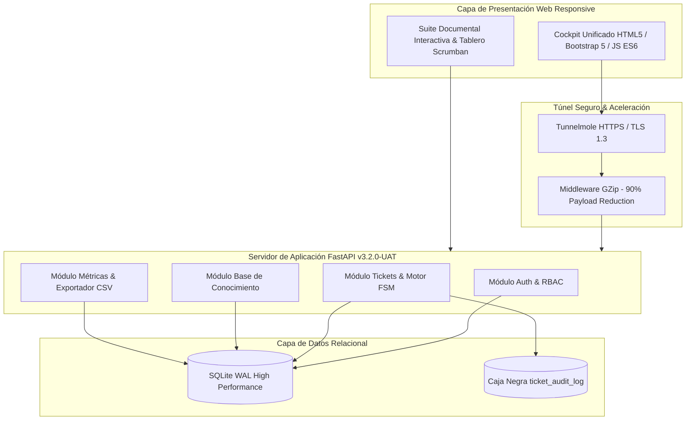
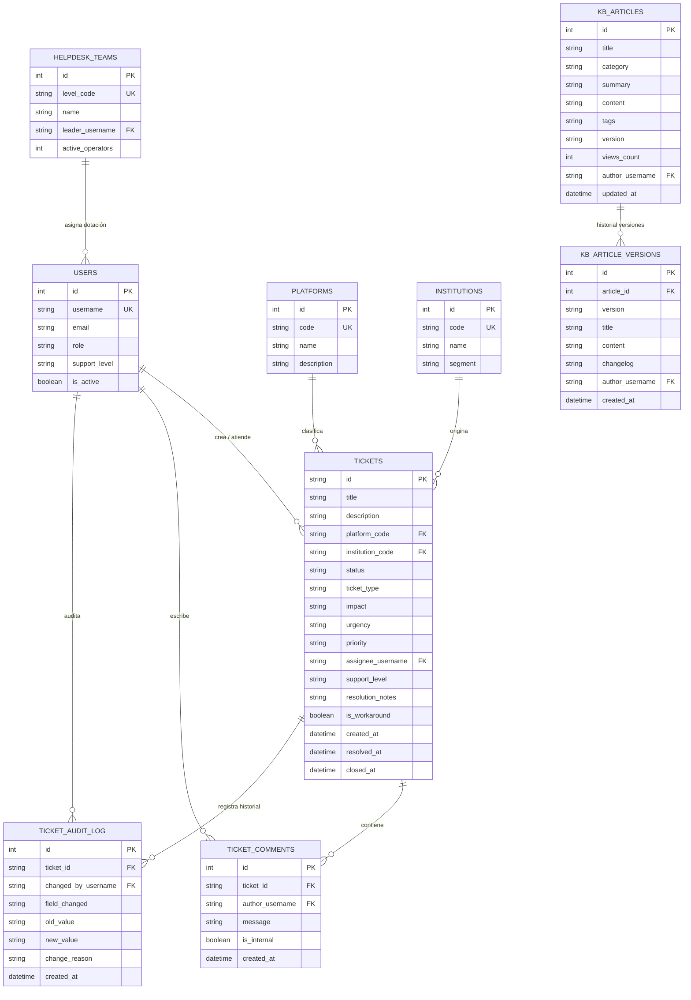

# QUANTUX SALUD • HEALTHDESK
## DOC-AR-003: ARQUITECTURA DE SOFTWARE Y DISEÑO TÉCNICO
### SISTEMA DE ALTA DISPONIBILIDAD PARA GESTIÓN DE INCIDENTES HEALTHTECH

---

### METADATOS Y CONTROL DOCUMENTAL
* **Código Documental:** DOC-AR-003
* **Versión Oficial:** v3.2.0-UAT
* **Fecha de Emisión:** Septiembre 2026
* **Arquitecto Principal:** Diego Martínez / Freddy Cortés
* **Comité Evaluador:** Paula Sbarbati, Carolina Brizuela, Nicolás Sánchez, Diego Martínez
* **Estado:** APROBADO & HOMOLOGADO (Certificación TQM Cero Defectos)

---

## 1. REGISTRO DE DECISIONES DE ARQUITECTURA (ADR) CON ESTÁNDAR IA

### ADR-01: Framework Backend y Persistencia Liviana de Alto Rendimiento
* **Contexto:** Se requiere un backend ágil con tipado estático, documentación OpenAPI automática y latencia $< 15$ ms para validación UAT en entornos clínicos sin depender de servidores pesados de base de datos.
* **Alternativas Consideradas:** Django REST Framework, Node.js/Express, FastAPI + SQLModel + SQLite WAL.
* **Recomendación IA:** FastAPI + SQLModel para máxima coherencia en schemas Pydantic y serialización nativa.
* **Decisión Adoptada:** FastAPI con SQLite en modo WAL (Write-Ahead Logging) y pool de conexiones concurrentes.
* **Mecanismo de Reversión / Fallback:** En caso de requerir migración a PostgreSQL en producción, SQLModel mantiene compatibilidad directa de modelos relacionales sin refactorizar la lógica de negocio.

### ADR-02: Máquina de Estados Finitos (FSM) Determinística de 6 Estados
* **Contexto:** Los tickets deben seguir un ciclo de vida asistencial estricto, impidiendo saltos ilegales (ej: resolver sin asignar, o modificar un ticket cerrado).
* **Decisión Adoptada:** Implementación de un motor determinístico en `app/core/fsm.py` con 6 estados:
  `NUEVO` $\longrightarrow$ `ASIGNADO` $\longrightarrow$ `EN_CURSO` $\longleftrightarrow$ `EN_ESPERA` $\longrightarrow$ `RESUELTO` $\longrightarrow$ `CERRADO` (Inmutable).

### ADR-03: Base de Conocimiento con Versionado Inmutable Relacional
* **Contexto:** Las guías clínicas sufren actualizaciones constantes (ej: nuevas normativas de firma digital PKCS#7); es mandatorio conservar el historial exacto de versiones consultadas en incidentes pasados.
* **Decisión Adoptada:** Creación de dos entidades relacionales acopladas: `kb_articles` (artículo vigente) y `kb_article_versions` (changelog histórico inmutable).

### ADR-04: Gobernanza de Agentes de IA y Asistencia Asistencial
* **Contexto:** Establecer límites técnicos inviolables sobre qué operaciones puede proponer la IA y qué transiciones requieren autorización humana explícita.
* **Decisión Adoptada:** La IA solo actúa en capa de lectura, análisis de texto libre, correlación de síntomas y sugerencia de protocolos; las operaciones de cambio de estado, asignación y cierre requieren firma e identidad de usuario autenticado en el token JWT.

---

## 2. DIAGRAMA DE ARQUITECTURA DEL SISTEMA

---

## 3. MODELO RELACIONAL DE DATOS (9 TABLAS OFICIALES)

---

## 4. CATÁLOGO DE ENDPOINTS REST (API v1)

| Módulo | Método | Ruta del Endpoint | Descripción Funcional | Permiso RBAC |
| :--- | :---: | :--- | :--- | :--- |
| **Auth** | `POST` | `/api/v1/auth/login` | Autenticación multi-perfil y entrega de rol | Público |
| **Tickets** | `GET` | `/api/v1/tickets` | Consulta de bandeja con filtros y búsqueda | Autenticado |
| **Tickets** | `POST` | `/api/v1/tickets` | Alta de ticket y cálculo determinístico $P=I \times U$ | Solicitante / Admin |
| **Tickets** | `GET` | `/api/v1/tickets/{id}` | Detalle completo de ticket, comentarios y auditoría | Autenticado |
| **Tickets** | `PUT` | `/api/v1/tickets/{id}` | Edición de ticket en estado `NUEVO` | Solicitante / Admin |
| **Tickets** | `POST` | `/api/v1/tickets/{id}/assign` | Asignación y toma de ticket por operador | Soporte / Admin |
| **Tickets** | `POST` | `/api/v1/tickets/{id}/escalate` | Escalamiento jerárquico N1 $\rightarrow$ N2 $\rightarrow$ N3 con motivo | Soporte / Admin |
| **Tickets** | `POST` | `/api/v1/tickets/{id}/status` | Transición a `EN_CURSO` o `EN_ESPERA` | Soporte / Admin |
| **Tickets** | `POST` | `/api/v1/tickets/{id}/resolve` | Resolución técnica obligatoria ($\ge 8$ car) y Workaround | Soporte / Admin |
| **Tickets** | `POST` | `/api/v1/tickets/{id}/close` | Cierre formal con conformidad del solicitante | Solicitante / Admin |
| **Tickets** | `POST` | `/api/v1/tickets/{id}/comments` | Publicación de comentarios públicos y notas internas | Autenticado |
| **KB** | `GET` | `/api/v1/articles` | Consulta y filtrado por categoría/tags en KB | Autenticado |
| **KB** | `POST` | `/api/v1/articles` | Publicación de nuevo artículo clínico | Soporte / Admin |
| **KB** | `PUT` | `/api/v1/articles/{id}` | Nueva versión (`v1.1`) con guardado histórico | Soporte / Admin |
| **KB** | `GET` | `/api/v1/articles/{id}/history` | Historial inmutable de versiones y changelog | Autenticado |
| **Mesas** | `GET` | `/api/v1/config/levels` | Tablero de dotación y mesas N1/N2/N3 | Soporte / Admin |
| **Métricas** | `GET` | `/api/v1/tickets/metrics/summary` | KPIs en tiempo real de volumen y SLA | Autenticado |
| **Métricas** | `GET` | `/api/v1/tickets/export/csv` | Exportación forense de tickets en CSV UTF-8 | Admin |

---

### APROBACIÓN DE ARQUITECTURA
* **Arquitecto / Lead Developer:** *Diego Martínez / Freddy Cortés*
* **Comité Evaluador:** *Paula Sbarbati, Carolina Brizuela, Nicolás Sánchez, Diego Martínez*
* **Versión:** `v3.2.0-UAT` • Septiembre 2026
