# QUANTUX SALUD • HEALTHDESK
## DOC-QA-004: INFORME DE PRUEBAS FUNCIONALES, VALIDACIÓN Y CERTIFICACIÓN TQM
### PROTOCOLO DE CALIDAD TOTAL (14 CICLOS • 560 PRUEBAS • CERO DEFECTOS)

---

### METADATOS Y CONTROL DOCUMENTAL
* **Código Documental:** DOC-QA-004
* **Versión Oficial:** v3.2.0-UAT
* **Fecha de Certificación:** Septiembre 2026
* **Líder de Calidad / QA Lead:** Carolina Brizuela / Freddy Cortés
* **Comité Evaluador:** Paula Sbarbati, Diego Martínez, Carolina Brizuela, Nicolás Sánchez
* **Estado:** CERTIFICADO CON CERO DEFECTOS (Zero Defects TQM)
* **Tasa de Éxito Global:** **100.0% (560 / 560 pruebas aprobadas)**

---

## 1. RESUMEN EJECUTIVO DE ASEGURAMIENTO DE CALIDAD

El presente informe certifica la ejecución del **Protocolo de Calidad Total (TQM)** sobre la versión **v3.2.0-UAT** de **Quantux HealthDesk**, abarcando las 38 Historias de Usuario en 14 ciclos consecutivos de pruebas automatizadas (7 en entorno Local de desarrollo y 7 en entorno Remoto UAT vía Túnel Seguro HTTPS).

### Indicadores Clave de Calidad y Rendimiento
* **Total de Ciclos Ejecutados:** 14 ciclos continuos sin interrupción.
* **Total de Casos de Prueba Ejecutados:** 560 casos de prueba funcionales.
* **Tasa de Éxito:** **100.0% PASSED** (0 Defectos Críticos, 0 Bloqueantes).
* **Latencia Media de Respuesta API (Local):** **3.82 ms** (Umbral máximo: 50 ms).
* **Latencia Media de Respuesta API (Túnel Remoto):** **38.4 ms** (Acelerado con compresión GZip).
* **Cobertura de Historias de Usuario:** **38 de 38 UHs (100% de Cobertura)**.

---

## 2. RESULTADOS DEL PROTOCOLO TQM DE 14 CICLOS CONSECUTIVOS

```mermaid
gantt
    title Protocolo de Calidad TQM (14 Ciclos Consecutivos)
    dateFormat  X
    axisFormat %s

    section Entorno Local
    Ciclo 1 Local (40/40) :done, 0, 1
    Ciclo 2 Local (40/40) :done, 1, 2
    Ciclo 3 Local (40/40) :done, 2, 3
    Ciclo 4 Local (40/40) :done, 3, 4
    Ciclo 5 Local (40/40) :done, 4, 5
    Ciclo 6 Local (40/40) :done, 5, 6
    Ciclo 7 Local (40/40) :done, 6, 7

    section Entorno Túnel UAT
    Ciclo 1 UAT (40/40)   :done, 7, 8
    Ciclo 2 UAT (40/40)   :done, 8, 9
    Ciclo 3 UAT (40/40)   :done, 9, 10
    Ciclo 4 UAT (40/40)   :done, 10, 11
    Ciclo 5 UAT (40/40)   :done, 11, 12
    Ciclo 6 UAT (40/40)   :done, 12, 13
    Ciclo 7 UAT (40/40)   :done, 13, 14
```

### Tabla Resumen de Ejecución TQM
| Entorno de Prueba | URL Base Evaluada | Ciclos | Pruebas Ejecutadas | Pruebas Aprobadas | Defectos | Estado de Certificación |
| :--- | :--- | :---: | :---: | :---: | :---: | :---: |
| **Local Desarrollo** | `http://127.0.0.1:8000` | 7 | 280 | 280 | 0 | 🟢 **Zero Defects (100%)** |
| **Público UAT (Tunnel)** | `https://9hbw3r...tunnelmole.net` | 7 | 280 | 280 | 0 | 🟢 **Zero Defects (100%)** |
| **CONSOLIDADO TOTAL** | **Ambos Entornos** | **14** | **560** | **560** | **0** | 🏆 **HOMOLOGADO 100%** |

---

## 3. EVIDENCIAS FORMALES DE GUARDRAILS Y REGLAS DE NEGOCIO

### 3.1. Validación de Guardrail de Solución Técnica ($\ge 8$ Caracteres)
* **Prueba Ejecutada:** Intento de resolución con string `"Listo"` (5 caracteres).
* **Resultado:** Rechazo determinístico con `HTTP 400 Bad Request` y mensaje `"La solución técnica debe contener al menos 8 caracteres explicativos."`.
* **Prueba Exitosa:** Envío de solución técnica explicativa `"Se reconfiguró el socket de firma PKCS#7 y se limpió la cola Redis."`.
* **Resultado:** Aceptación con `HTTP 200 OK`, guardado del flag `is_workaround = True` y timestamp de resolución.

### 3.2. Inmutabilidad Terminal del Estado CERRADO
* **Prueba Ejecutada:** Intento de mutación de título o estado sobre un ticket en estado `CERRADO`.
* **Resultado:** Bloqueo absoluto por el motor FSM con `HTTP 400 Bad Request`, garantizando no repudio y cumplimiento legal de auditoría sanitaria.

### 3.3. Confidencialidad y Aislamiento de Notas Internas (RBAC)
* **Prueba Ejecutada:** Consulta de ticket por usuario con rol `SOLICITANTE`.
* **Resultado:** Filtrado automático de notas con `is_internal = True`; el solicitante únicamente visualiza los comentarios públicos.

### 3.4. Trazabilidad Inmutable en Caja Negra (`ticket_audit_log`)
* **Prueba Ejecutada:** Ciclo completo de ticket (Alta $\rightarrow$ Asignación $\rightarrow$ Diagnóstico $\rightarrow$ Espera $\rightarrow$ Resolución $\rightarrow$ Cierre).
* **Resultado:** Registro de 11 eventos de auditoría correlacionados con autor, timestamp ISO, campo modificado y motivo de cambio.

---

### DICTAMEN FINAL DE CALIDAD
La versión **v3.2.0-UAT** de **Quantux HealthDesk** cumple con todos los criterios de aceptación, estándares de seguridad sanitaria y tiempos de respuesta, quedando **OFICIALMENTE CERTIFICADA PARA PRUEBAS UAT DE EVALUADORES Y COMITÉ**.

* **Responsable QA:** *Carolina Brizuela*
* **Solution Owner:** *Freddy Cortés*
* **Fecha:** Septiembre 2026
