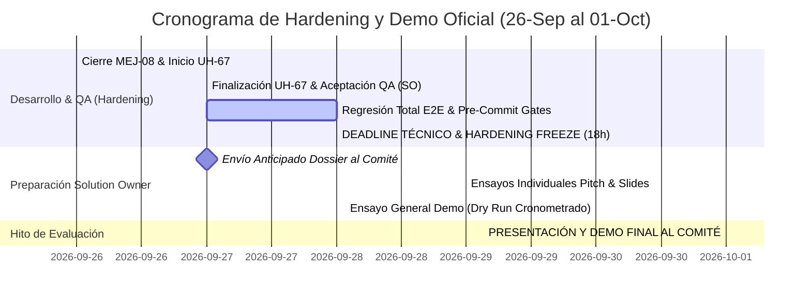

# ⏱️ CRONOGRAMA OPERATIVO: FASE DE HARDENING Y PRESENTACIÓN FINAL (01-OCT)
**Proyecto:** HealthDesk Quantux — Sistema Centralizado de Gestión de Tickets  
**Solution Owner:** Freddy Cortés (Analista Funcional)  
**Marco Metodológico:** Scrumban Adaptativo (PMI + IA) con Quality Gates TDD  
**Fecha de Línea Base:** 26 de Septiembre de 2026  
**Hito Final Inamovible:** **01 de Octubre de 2026 (Presentación y Demo ante Comité Evaluador)**  

---

## 1. Regla Mandatoria de Gobernanza: Alcance Cerrado (Scope Freeze)

> [!IMPORTANT]
> **POLÍTICA INQUEBRANTABLE:**  
> **El alcance del desarrollo técnico se encuentra estrictamente congelado (*Scope Freeze*).**  
> Ninguna nueva funcionalidad, requerimiento accesorio o idea emergente será admitida para ejecución. Cualquier necesidad detectada se registrará automáticamente en la columna **Product Backlog** para evaluación en ciclos posteriores a la presentación del 01 de Octubre.

---

## 2. Mapa Estratégico de Tiempos y Blindaje para el Solution Owner

Para garantizar que el Solution Owner cuente con **48 horas completas e ininterrumpidas** para preparar la narrativa, ajustar diapositivas y ensayar la demostración, el **Deadline Técnico Definitivo se adelanta al Lunes 28 de Septiembre a las 18:00 hs**.

---

## 3. Desglose Operativo Día por Día

### Sábado 26 de Septiembre de 2026 (Hoy) — Blindaje y Setup
* **Foco:** Estabilización de la gobernanza, supresión de toolbar y preparación de retrabajo.
* **Hitos del día:**
  * [x] Supresión de botonera administrativa en Tablero Scrumban (`MEJ-08`).
  * [x] Publicación del banner de Scope Freeze y actualización del Dossier previo para el Comité.
  * [x] Suite de 25 pruebas unitarias 100% verde y pre-commit hook verificado.
  * [ ] Definición de la estrategia técnica para la remediación de `UH-67` (subniveles N1).

---

### Domingo 27 de Septiembre de 2026 — Cierre Notarial Sprint 6 y Blindaje "Siete Llaves"
* **Foco:** Certificación formal del 100% de Sprint 6, resguardo criptográfico y despliegue continuo en la nube Render.
* **Hitos ejecutados y certificados:**
  * [x] **Cierre Notarial de Sprint 6:** Las 93 tareas de Sprint 6 aprobadas y certificadas en estado `done` (100%).
  * [x] **Protocolo Siete Llaves:** Snapshot relacional `healthdesk_v4.4.0_sprint6_closed_golden.db` (PRAGMA integrity_check OK) y bóveda ZIP de 80.74 MB con hash SHA-256 (`dcc097d7023b30e2d000f840cabc901db9d89553180bcae3dfab1d6c37b94cbd`).
  * [x] **Despliegue Continuo Cloud en Render:** Validación en producción pública (`https://healthdesk-quantux.onrender.com/`) y hotfix de compatibilidad Python 3.11.
  * [x] **Apertura de Sprint 7:** 13 tareas activas en `sprint` (35 Story Points) listas para ejecución el Lunes 28.
  * [x] **Actualización Integral de la Suite Documental:** DOC-MGT-001 a DOC-GOV-008 alineados a v4.4.0.

---

### Lunes 28 de Septiembre de 2026 — EJECUCIÓN SPRINT 7 & DEADLINE TÉCNICO DEFINITIVO (18:00 hs)
* **Foco:** Ejecución y certificación de las tareas priorizadas de Sprint 7, preservando el congelamiento absoluto a las 18:00 hs.
* **Cronograma horario:**
  * **09:00 - 13:00 hs:** Implementación de tareas prioritarias de Sprint 7 (`ISSUE-65` persistencia de SLA en caliente, `ISSUE-55`, `ISSUE-56`, `PWA-01`).
  * **13:00 - 16:00 hs:** Pase a QA y certificación por el Solution Owner.
  * **16:00 - 17:30 hs:** Auditoría final pre-commit:
    * `validate_ojo_compliance.py` (Cero violaciones a Pizarra Neutral).
    * `tests/test_dom_visual_compliance.py` (Fidelidad visual frente a Figma).
    * `backend/tests/test_reemplazo_n1_suite.py` (Integridad backend e ITIL).
    * `backend/tests/golden_test_cd2_suite.py` (Triage asistencial sin alucinaciones).
  * **18:00 hs PUNTUAL — 🛑 CORTE TÉCNICO DEFINITIVO (CODE FREEZE TOTAL):**
    * Ningún commit de código de backend o frontend a partir de este instante.
    * Base de datos SQLite estabilizada y respaldada.
    * Despliegue final a Render Cloud y local 100% verificado.
    * 48 horas limpias y garantizadas para la preparación exclusiva del Solution Owner.

---

### Martes 29 de Septiembre de 2026 — Día 1: Preparación del Solution Owner (Blindado)
* **Foco exclusivo:** Narrativa, diapositivas y asimilación de devoluciones del Comité.
* **Actividades del Solution Owner:**
  * Revisión y ajuste de las diapositivas ejecutivas ([`docs/06_Presentacion_Ejecutiva_Quantux.html`](file:///C:/Users/FERO_ADM/.gemini/antigravity/scratch/quantux-v4-dev/docs/06_Presentacion_Ejecutiva_Quantux.html) y PPTX).
  * Ensayo individual de la narrativa de los 5 pasos del MVP (Crear → Asignar → Gestionar → Resolver → Cerrar).
  * Incorporación de las preguntas o inquietudes anticipadas que hayan enviado Paula Sbarbati, Diego Martínez o Carolina Brizuela.

---

### Miércoles 30 de Septiembre de 2026 — Día 2: Ensayo General (Dry Run)
* **Foco exclusivo:** Ensayos cronometrados y calibración de respuestas de alta solidez.
* **Actividades del Solution Owner:**
  * **Simulacro 1 (Pitch de 15 minutos):** Validación de ritmo, transiciones y énfasis en las fortalezas del **Proceso (PMI+IA)** y **Calidad (Quality Gates / TDD)**.
  * **Simulacro 2 (Manejo de Preguntas Difíciles):**
    * Preguntas técnicas de Diego Martínez (SQLite vs Postgres, contratos REST, cobertura de pruebas).
    * Preguntas funcionales de Paula Sbarbati (usabilidad para médicos y clínicas).
    * Preguntas de negocio de Nicolás Sánchez (escalabilidad a los 14 clientes y ROI del soporte centralizado).
  * Descanso y mentalización para el evento formal.

---

### Jueves 01 de Octubre de 2026 — DÍA D: Presentación Oficial y Evaluación
* **09:00 hs:** Verificación de entorno local (`uvicorn` en puerto 8000, navegador listo en pantalla Cockpit).
* **Hora del Pitch:** Presentación formal ante el Comité Evaluador.
* **Cierre:** Devolución del Comité y homologación final del MVP.

---

## 4. Matriz de Alerta Temprana de Desvíos (Early Warning System)

Para asegurar que ningún imprevisto técnico comprometa el tiempo de preparación del Solution Owner, rigen los siguientes disparadores de contingencia:

| Nivel de Alerta | Condición Disparadora | Momento de Control | Acción de Mitigación Inmediata |
| :---: | :--- | :--- | :--- |
| 🟢 **VERDE** | Tareas en QA dentro de plazo; tests pasando al 100%. | Domingo 27/09 14:00 hs | Continuar flujo planificado normal. |
| 🟡 **AMARILLO** | `UH-67` presenta complejidad no prevista o demora en pruebas. | Domingo 27/09 16:00 hs | Se simplifica la interacción de subniveles al flujo estricto del caso demo sin tocar lógica profunda. |
| 🔴 **ROJO** | Cualquier fallo técnico que persista pasadas las 14:00 hs del Lunes 28/09. | Lunes 28/09 14:00 hs | **Descope Preventivo Inmediato:** Se traslada el ítem observado al Product Backlog. **Bajo ninguna circunstancia se extiende el deadline de las 18:00 hs.** |

---

## 5. Ubicaciones del Cronograma en el Ecosistema del Proyecto

Este cronograma se encuentra replicado y sincronizado en los siguientes puntos clave:
1. **Archivo Maestro:** [`docs/CRONOGRAMA_HARDENING_Y_DEMO_01_OCT.md`](file:///C:/Users/FERO_ADM/.gemini/antigravity/scratch/quantux-v4-dev/docs/CRONOGRAMA_HARDENING_Y_DEMO_01_OCT.md).
2. **Tablero Scrumban Vivo (Pestaña Roadmap):** [`docs/00_Tablero_Scrumban_Quantux.html`](file:///C:/Users/FERO_ADM/.gemini/antigravity/scratch/quantux-v4-dev/docs/00_Tablero_Scrumban_Quantux.html#roadmap) (Milestones M6, M7, M8 actualizados).
3. **Plan de Gestión del Proyecto (Sección 6):** [`docs/01_PLAN_DE_GESTION_DEL_PROYECTO.md`](file:///C:/Users/FERO_ADM/.gemini/antigravity/scratch/quantux-v4-dev/docs/01_PLAN_DE_GESTION_DEL_PROYECTO.md).
4. **Dossier del Comité Evaluador (Sección 1 y 4):** [`docs/DOSSIER_ENTREGA_PREVIA_COMITE_EVALUADOR.md`](file:///C:/Users/FERO_ADM/.gemini/antigravity/scratch/quantux-v4-dev/docs/DOSSIER_ENTREGA_PREVIA_COMITE_EVALUADOR.md).
