# 📋 DOSSIER DE ENTREGA ANTICIPADA AL COMITÉ EVALUADOR
**Proyecto:** HealthDesk Quantux — Sistema Centralizado de Gestión de Tickets de Soporte  
**Organización:** Quantux Salud  
**Solution Owner:** Freddy Cortés (Analista Funcional)  
**Fecha de Emisión:** 26 de Septiembre de 2026  
**Fecha de la Presentación Final (Demo):** **01 de Octubre de 2026**  
**Fase de Gestión:** **Hardening & Estabilización (Scope Freeze Activo)**  

---

### Destinatarios — Comité Evaluador
* **Paula Sbarbati** — Referente Funcional
* **Diego Martínez** — Facilitador Técnico
* **Carolina Brizuela** — Capital Humano
* **Nicolás Sánchez** — Gerencia General

---

## 1. Propósito de este Documento

Este dossier consolida el **paquete documental y técnico integral** de HealthDesk Quantux para su **revisión previa y evaluación anticipada** por parte de los miembros del Comité Evaluador, con el propósito de:
1. Facilitar la lectura previa de las especificaciones, decisiones de arquitectura y reportes de calidad antes del evento formal del **01 de Octubre de 2026**.
2. Canalizar devoluciones, preguntas y observaciones tempranas para calibrar la presentación final.
3. Transparentar la fase de **Hardening & Estabilización (Scope Freeze)** en la que se encuentra el equipo de desarrollo.

> [!NOTE]
> **ESTADO DE LA FASE ACTUAL: HARDENING Y ESTABILIZACIÓN**  
> El alcance de desarrollo se encuentra **estrictamente cerrado (*Scope Freeze*)**. El equipo técnico está abocado al 100% en el ciclo iterativo de *Test → Debug → Fix → Re-test*, estabilización de entornos y cierre de observaciones pendientes (`UH-67`, `MEJ-08`). Cualquier nueva sugerencia o funcionalidad adicional identificada en esta revisión se catalogará de forma reglada en el **Product Backlog** para evolutivos posteriores.

---

## 2. Mapa de Navegación del Paquete Documental

Para facilitar la revisión por especialidad y rol evaluador, la documentación se estructura en cinco módulos temáticos:

```mermaid
flowchart TD
    Dossier["📋 Dossier Previo (01-Oct)"] --> M1["1. Gobernanza & Gestión"]
    Dossier --> M2["2. Requerimientos & UX"]
    Dossier --> M3["3. Arquitectura & Datos"]
    Dossier --> M4["4. Calidad, QA & Release"]
    Dossier --> M5["5. Pitch & Demostración"]

    M1 --> D01["Plan de Gestión (DOC-MGT-001)"]
    M1 --> D08["Marco PMI+IA (DOC-GOV-008)"]
    M1 --> D00["Tablero Scrumban Vivo"]

    M2 --> D02["Especificación 48 UHs (DOC-SPEC-002)"]
    M2 --> D05["Manual Operativo (DOC-OPS-005)"]

    M3 --> D03["Arquitectura Técnica (DOC-ARC-003)"]
    M3 --> DAPI["Contratos de API REST"]

    M4 --> D04["Reporte QA & Evidencias (DOC-QA-004)"]
    M4 --> DVisual["Auditoría Mocks vs Real"]
    M4 --> DRel["Notas de Versión v4.3.0"]

    M5 --> D07["Guión de Pitch (DOC-COM-007)"]
    M5 --> D06["Presentación Ejecutiva HTML/PDF"]
```

---

## 3. Índice Detallado de Entregables por Módulo

### Módulo 1: Dirección, Gobernanza PMI+IA y Gestión Visual
*Orientado especialmente a: **Nicolás Sánchez** (Gerencia General) y **Carolina Brizuela** (Capital Humano).*

1. **[Plan de Gestión del Proyecto (DOC-MGT-001)](file:///C:/Users/FERO_ADM/.gemini/antigravity/scratch/quantux-v4-dev/docs/01_PLAN_DE_GESTION_DEL_PROYECTO.md):**  
   Define el alcance oficial del MVP, estructura organizativa, matriz RACI, gestión de riesgos preventivos y el cronograma de 6 Sprints hacia el hito del 01 de Octubre.
2. **[Marco de Trabajo PMI + IA y Gobernanza de Calidad (DOC-GOV-008)](file:///C:/Users/FERO_ADM/.gemini/antigravity/scratch/quantux-v4-dev/docs/08_MARCO_DE_TRABAJO_PMI_IA_Y_GOBERNANZA_CALIDAD.md):**  
   Fundamento de la adaptación metodológica del PMBOK® 7ª Edición potenciada por IA generativa, incluyendo la política de no alucinación, compuertas TDD y pre-commit hooks.
3. **[Tablero Interactivo de Control Scrumban](file:///C:/Users/FERO_ADM/.gemini/antigravity/scratch/quantux-v4-dev/docs/00_Tablero_Scrumban_Quantux.html):**  
   Tablero web interactivo en tiempo real que exhibe las 6 columnas del flujo de trabajo, métricas de velocidad, roadmap y 103 ítems clasificados con enlaces documentales directos.
4. **[Catálogo Exportable de Backlog (CSV)](file:///C:/Users/FERO_ADM/.gemini/antigravity/scratch/quantux-v4-dev/docs/Backlog_HealthDesk_Quantux.csv):**  
   Base de datos tabular completa de historias de usuario, tareas técnicas, issues y mejoras con sus respectivos Story Points y estados.

---

### Módulo 2: Especificación Funcional, Procesos y Experiencia de Usuario
*Orientado especialmente a: **Paula Sbarbati** (Referente Funcional).*

1. **[Especificación Funcional y Backlog de 48 Historias (DOC-SPEC-002)](file:///C:/Users/FERO_ADM/.gemini/antigravity/scratch/quantux-v4-dev/docs/02_ESPECIFICACION_FUNCIONAL_Y_BACKLOG.md):**  
   Relevamiento exhaustivo de las 9 Épicas del producto, criterios de aceptación en formato Given-When-Then (Gherkin) y reglas de negocio del circuito de tickets (Nuevo → Asignado → En Curso → Resuelto → Cerrado).
2. **[Manual Operativo y Guía de Usuario (DOC-OPS-005)](file:///C:/Users/FERO_ADM/.gemini/antigravity/scratch/quantux-v4-dev/docs/05_MANUAL_OPERATIVO_Y_GUIA_USUARIO.md):**  
   Instrucciones paso a paso de uso para Solicitantes, Operadores N1/N2/N3, Administradores y Team Leaders.
3. **[Mapeo de Historias de Usuario vs Desarrollo Real (DOC-MAP-006)](file:///C:/Users/FERO_ADM/.gemini/antigravity/scratch/quantux-v4-dev/docs/06_MAPEO_HISTORIAS_USUARIO_VS_DESARROLLO.md):**  
   Matriz de trazabilidad que conecta cada requerimiento funcional con su implementación de software.

---

### Módulo 3: Arquitectura de Software, Seguridad y Datos
*Orientado especialmente a: **Diego Martínez** (Facilitador Técnico).*

1. **[Arquitectura Técnica y Diseño de Componentes (DOC-ARC-003)](file:///C:/Users/FERO_ADM/.gemini/antigravity/scratch/quantux-v4-dev/docs/03_ARQUITECTURA_Y_DISENO_TECNICO.md):**  
   Diagramas C4 (Contexto, Contenedores, Componentes), justificación del stack (FastAPI en Python, SQLite transaccional, Vanilla JS SPA), modelo Entidad-Relación y multi-tenancy institucional.
2. **[Contratos de API REST y Esquema OpenAPI](file:///C:/Users/FERO_ADM/.gemini/antigravity/scratch/quantux-v4-dev/docs/API_CONTRACTS.md):**  
   Endpoints documentados, esquemas Pydantic y códigos de respuesta HTTP de todos los microservicios backend.

---

### Módulo 4: Calidad, Evidencias Forenses y Certificación Pre-Release
*Orientado a todo el Comité Evaluador.*

1. **[Informe de Pruebas, Auditoría TQM y Evidencias Fotográficas (DOC-QA-004)](file:///C:/Users/FERO_ADM/.gemini/antigravity/scratch/quantux-v4-dev/docs/04_INFORME_DE_PRUEBAS_Y_EVIDENCIAS.md):**  
   Registro pormenorizado de casos de prueba, matrices de trazabilidad, capturas de pantalla de hallazgos y su resolución.
2. **[Informe Comparativo Visual: Mocks Oficiales vs Implementación Real (HTML)](file:///C:/Users/FERO_ADM/.gemini/antigravity/scratch/quantux-v4-dev/docs/Informe_Comparativo_Visual_Mocks_vs_Implementacion.html) / [(Versión PDF)](file:///C:/Users/FERO_ADM/.gemini/antigravity/scratch/quantux-v4-dev/docs/Informe_Comparativo_Visual_Mocks_vs_Implementacion.pdf):**  
   Análisis forense lado a lado que certifica la fidelidad visual de la interfaz frente a los diseños institucionales.
3. **[Notas de Versión Candidata v4.3.0](file:///C:/Users/FERO_ADM/.gemini/antigravity/scratch/quantux-v4-dev/docs/RELEASE_NOTES_v4.3.0.md):**  
   Resumen de las últimas intervenciones Senior UX (Matriz Multi-Tenant, buscador predictivo, normalización de interruptores y compuertas pre-commit).

---

### Módulo 5: Presentación Ejecutiva y Preparación de la Demo del 01-Oct
*Material de apoyo para la sesión de demostración final.*

1. **[Presentación Ejecutiva Interactiva (Diapositivas Web)](file:///C:/Users/FERO_ADM/.gemini/antigravity/scratch/quantux-v4-dev/docs/06_Presentacion_Ejecutiva_Quantux.html) / [(Formato PDF)](file:///C:/Users/FERO_ADM/.gemini/antigravity/scratch/quantux-v4-dev/docs/06_Presentacion_Ejecutiva_Quantux.pdf) / [(PowerPoint PPTX)](file:///C:/Users/FERO_ADM/.gemini/antigravity/scratch/quantux-v4-dev/docs/PRESENTACION_EJECUTIVA_QUANTUX_HEALTHDESK.pptx):**  
   Presentación visual de alto impacto para proyectar durante la reunión con el Comité.
2. **[Guión y Pitch de Demostración Operativa (DOC-COM-007)](file:///C:/Users/FERO_ADM/.gemini/antigravity/scratch/quantux-v4-dev/docs/07_GUION_Y_SLIDES_PRESENTACION_EJECUTIVA.md):**  
   Estructura temporal del pitch (15 minutos) con el paso a paso del caso de demostración en vivo.

---

## 4. Canales y Mecanismo para Devolución Temprana

Agradecemos al Comité Evaluador remitir sus consultas, devoluciones u observaciones técnicas y funcionales con anterioridad al **30 de Septiembre de 2026** a fin de ser incorporadas en los ensayos finales del pitch:

| Evaluador | Enfoque Principal de Revisión Sugerido |
| :--- | :--- |
| **Paula Sbarbati** | Flujo asistencial de tickets, claridad en categorización por plataforma clínica, usabilidad del Cockpit. |
| **Diego Martínez** | Arquitectura FastAPI, integridad de datos en SQLite, robustez de la API REST y cobertura de tests. |
| **Carolina Brizuela** | Experiencia de usuario para los operadores de soporte, curva de aprendizaje y manual operativo. |
| **Nicolás Sánchez** | Alineación estratégica del MVP con los 14 clientes de Quantux, KPIs de gestión y cumplimiento del timebox. |

---

*Documento preparado por el equipo de desarrollo de HealthDesk Quantux bajo la dirección del Solution Owner Freddy Cortés.*
